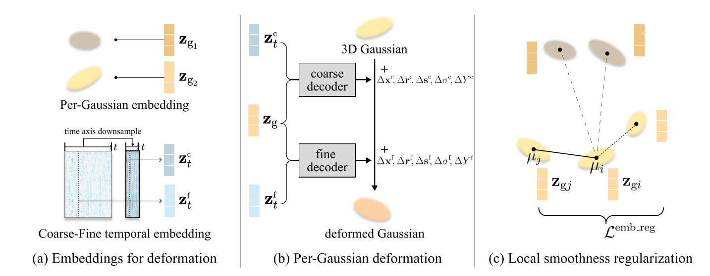

# Per-Gaussian Embedding-Based Deformation for Deformable 3D Gaussian Splatting

- https://arxiv.org/pdf/2404.03613
- https://jeongminb.github.io/e-d3dgs/
- https://github.com/JeongminB/E-D3DGS

## 概要
- 研究対象は動画のNVS
- 既存研究はdeformable NeRFと同じように各時刻におけるcanonical spaceの3dGSからの差分をNN $f\left(x, y, z, t\right)$に学習させるもの
- このdeformationをgaussianごとに持たせるべきという主張
- やったことは以下の3つ
  - 各時刻におけるcanonical spaceからのdeformationを得るために各gaussianにembeddingを持たせて、それとは別に各時刻ごとにteporal embeddingを持たせる
  - temporal variationsをcoarse deformationとfine deformationに分割
    - coarse deformationは大きくて遅い動きを持つ
    - fine deformationはcoaseがカバーしきれていない早くて細かい動きをもつ
    - per-Gaussian embeddingに対してlocal smoothness regularizationの導入
      - 近くにいるGaussianのembeddingが近くなるようにするための正規化

## 関連研究
- Deforming 3D Canonical Space
  - D-NeRF
  - Nerfies
  - Hyper-NeRF
  - HyperReel
- Dynamic 3D Gaussians
  - 4DGaussians
  - D3DGS
  - 4DGS
- Latent Embedding on Novel View Synthesis
  - NeRF-W
  - Block-NeRF
  - DyNeRF
  - HyperNeRF
  - Sync-NeRF
- Considering Spatial Relationship of Gaussians
  - Scaffold-GS
  - SAGS
  - SC-GS
  - GaussianPrediction
  - Dynamic 3D Gaussians

## 提案手法
- 提案手法は下図

- 各Gaussianに学習可能なembedding $z_{g_i}$を持たせる
- 各フレームごとに学習可能なembedding $z_t$を持たせる
- 各フレームのGaussianのパラメータはcanonical gaussianのパラメータにNN $\mathcal{F}$から得られる値を足し合わせることで得られる
$$
\mathcal{F}_{\theta}\left(z_g, z_t\right) = \left(\delta x, \delta r, \delta s, \delta \sigma, \delta Y\right)
$$
- $x$はgaussianの位置, $r$はrotation quaternion, $s$はvector for scaling, $\sigma$はopacity, $Y$はSH係数
- $z_t$は実際はcoarse $z_t^c$とfine $z_t^f$に分割される
- NNも画像のように2つに分割されて$\mathcal{F}_{\theta_c}\left(z_g, z_t^c\right)$, $\mathcal{F}_{\theta_f}\left(z_g, z_t^f\right)$のように使用される
- local smoothness regularizationとして以下のlossを導入
- これにより近いgaussianは近いembeddingを持つ
$$
\mathcal{L}^{\mathrm{emb_reg}} = \frac{1}{k | \mathcal{S} |}\sum_{i\in \mathcal{S}} \sum_{j \in \mathrm{KNN}_{i;k}}\left(w_{i,j}\| z_{gi} - z_{gj} \|_2\right)
$$
- ここで、$w_{i,j} = \exp \left(-\lambda_w \| \mu_j - \mu_i \|^2_2\right)$であり$\mu$はGaussianの位置で$\lambda_w$と$k$はハイパラ
- 学習は普通にrenderingしてL1 lossとssim loss
## 英語
- deformation : 変形
- decompose : 分解する
- polynomial : 多項式
- scaffold : 足場