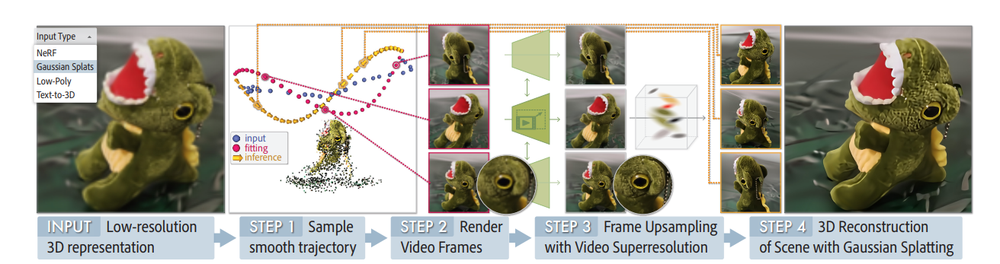

# SuperGaussian: Repurposing Video Models for 3D Super Resolution
- https://arxiv.org/pdf/2406.00609

## 概要
- タスクはHRNVS
- LRでgaussian splattingを学習した後にHRでgaussianをfine tuningするといういつもの流れ
- だが、pseudo HRを作成するのは2D SR modelではなく3D SR model
- 3DSRをするために、LRで学習したGSから画像をrenderingする際にsmooth trajectoryを考える
- これで複数のレンダリングされた画像が連続的になり動画として扱える

## related work
- image super resolution
  - SRDiff
- video super resolution
  - Upscale-A-Video: Temporalconsistent diffusion model for real-world video super-resolution
  - VideoGigaGAN
- Image-Based 3D super resolution
  - Super-NeRF
  - RefSR-NeRF
  - NeRF-SR
  - CROP
- 3D aware GAN
  - Efficient Geometry-aware 3D Generative Adversarial Networks(CVPR2022)
  - AG3D: Learning to Generate 3D Avatars from 2D Image Collections(ICCV2023)
- Feed-forward 3D Super Resolution
  - RODIN: A generative model for sculpting 3d digital avatars using diffusion(CVPR2022)
  - Locally attentional SDF diffusion for controllable 3D shape generation

## SuperGaussian

(論文より引用)
- 図を見ればわかる
- まずLRでgaussian学習
- 次にsmoth trajectory(なめらかな軌跡)を考えて画像をrendering
- この画像をtrajectoryに従って並べると連続的な動画となる
- この動画を3DSR modelに入れて解像度を上げる
- 得られたpseudo HRでgaussian再学習

## 英単語
- consolidation : 統合
- agnostic : 不可知論的な
  - 情報工学ではソフトウェアやハードウェアが特定のプロトコル、プログラムに依存しない設計であること
- repurpose : 別の目的で使う、転用する
- conciseness : 簡潔さ、明瞭さ
- trajectory : 軌跡