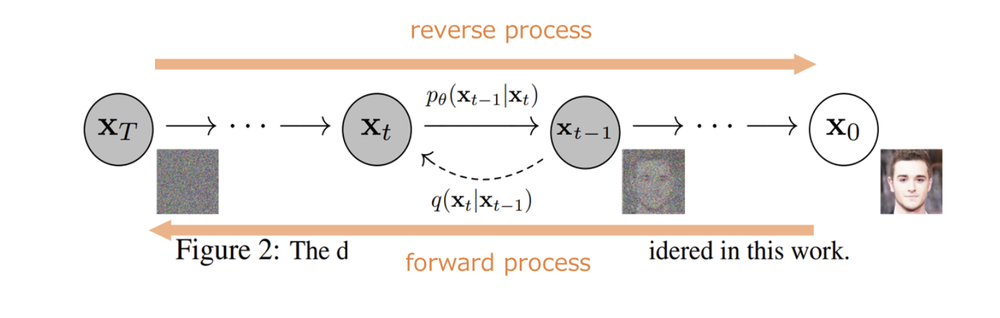

# DDPM
## 数式について
  - 以下全てのxとzとIとμとΣは太字、それ以外全部スカラー
    - $\boldsymbol{x}$
    - $\boldsymbol{z}$
    - $\boldsymbol{I}$
    - $\boldsymbol{\mu_{\theta}}$
    - $\boldsymbol{\Sigma_{\theta}}$ 
  - \boldsymbol{}書くの面倒だった

## ソース
  - [[https://arxiv.org/abs/2006.11239|Denoising Diffusion Probabilistic Models]]

## 概要
  - 2020年に公開
  - diffusion modelは2015年に提案されている
    - 論文:Deep Unsupervised Learning using NoneQuilibriumu Thermodynamics
  - 本論文では上記の論文のうち以下の2点を改良した
    - 1. 逆拡散過程における分散 $\sum_{\theta}(x_t,t)$ を学習パラメータではなく $\beta_t$ と固定した
      - diffusion modelでは各状態における分散をニューラルネットワークで表現して学習させていた
      - DDPMでは学習させずに簡略化
      - 実験した結果こっちの方がよかったらしい
    - 2. 目的関数の単純化
      - diffusion modelの損失関数は以下 $$\mathbb{E}_{x_0,\epsilon}\left[\frac{\beta_t}{2\sigma_t^2\alpha_t\left(1-\bar{\alpha_t}\right)} \| \epsilon - \epsilon_{\theta}\left(\sqrt{\bar{\alpha_t}}x_0+\sqrt{1-\bar{\alpha_t}}\epsilon,t\right)\|^2\right]$$
      - DDPMでは以下 
$$L_{\rm{simple}}\left(\theta\right):=\mathbb{E}_{t,x_0,\epsilon}\left[ \| \epsilon - \epsilon_{\theta}\left(\sqrt{\bar{\alpha_t}}x_0+\sqrt{1-\bar{\alpha_t}}\epsilon,t\right)\|^2\right]$$

- 実験した結果こっちの方が良かったらしい

## 拡散モデル
###  概要
  - Diffusion Model(拡散モデル)はforward process(拡散過程)とreverse process(逆拡散過程or生成過程)からなる
  - VAEのように潜在変数をもつ($x_1,\cdots,x_T$)
    - この考え方を損失関数のときに使うから大事 

  - forward process
    - 画像にノイズを加えていって最終的にノイズになる確率過程
    - 学習するパラメータなし
    - 正規分布からサンプリングするから決定的ではなく確率的
  - reverse process
    - ノイズから画像にする確率過程 
    - 学習するパラメータもあるし正規分布からサンプリングもする
    - forward processで加えたノイズを予測したい
    - そのために、forward processでサンプリングした正規分布の平均及び分散をNNで表現して学習すれば良い(論文ではU-netを使用)
  - どちらの過程もマルコフ連鎖である(ある状態が1個前の状態のみに依存)
  - よって、各過程は以下の式で書ける(上:reverse,下:forward)
$$
p_{\theta}\left(x_{0:T}\right) := p\left(x_T\right)\prod_{t=1}^{T}{p_{\theta}\left(x_{t-1}|x_t\right)}, \quad 
p_{\theta}\left(x_{t-1}|x_t \right) := \mathcal{N}\left(x_{t-1};\mu_{\theta}\left(x_t,t\right),\Sigma_{\theta}(x_t,t)\right) \\
q\left(x_{1:T}|x_0\right) := \prod_{t=1}^{T}{q\left(x_{t}|x_{t-1}\right)}, \quad 
q\left(x_t|x_{t-1} \right) := \mathcal{N}\left(x_t;\sqrt{1-\beta_t}x_{t-1},\beta_tI\right)
$$

### forward process
  - forward process(diffusion process)
$$
q\left(x_{1:T}|x_0\right) := \prod_{t=1}^{T}{q\left(x_{t}|x_{t-1}\right)} \\
q\left(x_t|x_{t-1} \right) := \mathcal{N}\left(x_t;\sqrt{1-\beta_t}x_{t-1},\beta_tI\right)
$$
  - 以下、上記の同時確率分布及び$x_t$を$x_0$から直接計算する方法導出

  - 入力画像$x_0$、潜在変数$x_1,\cdots,x_T$に対して各状態遷移は以下の式で定まる。
$$

x_t = \sqrt{1-\beta_t}x_{t-1}+\sqrt{\beta_t}\epsilon_t,\quad \epsilon_t=\mathcal{N}\left(0,I\right)
$$
  - $\beta_t \in [0,1]$はハイパーパラメータであり事前に決まっている
  - 状態$x_t$から$x_{t+1}$に遷移するときにどれだけノイズを加えるかを調整
    - 式より、1に近いほどすぐにノイズに到達することがわかる 
  - 潜在変数の同時確率分布は以下 

$$
\begin{align}
&\begin{split}
q\left(x_{1:T}|x_0\right) &= q\left(x_1|x_0\right)q\left(x_2|x_1\right)\cdots q\left(x_T|x_{T-1}\right) \\
  &= \prod_{t=1}^{T}{q\left(x_{t}|x_{t-1}\right)}
\end{split}
\end{align}
$$

 ここで$x_0$から$x_t$を求めるときに$t$回計算するのではなく直接求めるために、拡散過程の遷移式を以下のように変形する

$$
\begin{align}
&\begin{split}
x_2 
&= \sqrt{1-\beta_2}x_{1}+\sqrt{\beta_2}\epsilon_2 
\\
 &= 
\sqrt{1-\beta_2}\left(\sqrt{1-\beta_1}x_0+\sqrt{1-\left(1-\beta_1\right)}\epsilon_1\right)+\sqrt{\beta_2}\epsilon_2
\\
 &= 
\sqrt{\left(1-\beta_1\right)\left(1-\beta_2\right)}x_0+
\sqrt{1-\beta_2-\left(1-\beta_1\right)\left(1-\beta_2\right)}\epsilon_1+
\sqrt{\beta_2}\epsilon_2
\\
&=
\sqrt{\left(1-\beta_1\right)\left(1-\beta_2\right)}x_0+
\sqrt{1-\left(1-\beta_1\right)\left(1-\beta_2\right)}\epsilon \quad \left(\because {\rm{正規分布の和の再生性}}\right)
\end{split}
\end{align}
$$
ただし、$\epsilon = \mathcal{N}\left(0,I\right)$である

これを$t$まで繰り返すと

$$
\begin{align}
&\begin{split}
x_t
&=
\sqrt{\left(1-\beta_1\right) \left(1-\beta_2\right) \cdots \left(1-\beta_t\right)}x_0
+\sqrt{1-\left(1-\beta_1\right) \left(1-\beta_2\right) \cdots \left(1-\beta_t\right)}\epsilon
\\
&=
\sqrt{\bar{\alpha_t}}x_0+\sqrt{1-\bar{\alpha_t}}\epsilon
\end{split}\end{align}$$

ただし、$\alpha=1-\beta \quad \bar{\alpha_t} = \prod_{s=1}^{T}{\left(1-\beta_s\right)}=\prod_{s=1}^{T}{\alpha_t}$

ちなみに、$t \to \infty$を考えると$\bar{\alpha_t} \to 0$になるので$x_t \to \epsilon$

### reverse process
  - forwardの逆で、逆拡散過程と呼ばれる
  - $x_t$から$x_0$を得るために、確率分布$q\left(x_{t-1}|x_t\right)$しりたいが、$q\left(x_t\right)$が未知であるからベイズの定理使っても計算不可能
  - そこでNN(本論文ではU-Net)でこの確率分布を近似する
  - 確率分布を近似するために平均と分散を推定するようなネットワークをつくる(それぞれ$\mu_{\theta}\left(x_t,t\right)$,$\Sigma_{\theta}\left(x_t,t\right)$)
    - StableDiffusinを使っていて同じテキストを入れても異なる画像が出力されるのはこれが理由
      - 学習済みモデルを使用して平均値と分散は固定であるが、生成のたびにシード値を変えてサンプリングしているから
      - 逆にサンプリングのためのシード値が同じなら全く同じ画像になるはず 
    - 入力は状態位置情報もほしいから$x$だけてはなく$t$も必要
    - DDPMでは$\Sigma_{\theta}$はない、拡散過程と同じ$\beta_t$をそのまま使う

$$
\begin{align}
&\begin{split}
p_{\theta}\left(x_{0:T}\right) &:= p\left(x_T\right)\prod_{t=1}^{T}{p_{\theta}\left(x_{t-1}|x_t\right)}, \\
p_{\theta}\left(x_{t-1}|x_t \right) &:= \mathcal{N}\left(x_{t-1};\mu_{\theta}\left(x_t,t\right),\Sigma_{\theta}(x_t,t)\right)
\end{split}\end{align}
$$

### 損失関数
  - diffusion model2015では以下
$$\mathbb{E}_{x_0,\epsilon}\left[\frac{\beta_t}{2\sigma_t^2\alpha_t\left(1-\bar{\alpha_t}\right)} \| \epsilon - \epsilon_{\theta}\left(\sqrt{\bar{\alpha_t}}x_0+\sqrt{1-\bar{\alpha_t}}\epsilon,t\right)\|^2\right]$$
  - DDPMでは係数削って以下 
$$L_{\rm{simple}}\left(\theta\right):=\mathbb{E}_{t,x_0,\epsilon}\left[ \| \epsilon - \epsilon_{\theta}\left(\sqrt{\bar{\alpha_t}}x_0+\sqrt{1-\bar{\alpha_t}}\epsilon,t\right)\|^2\right]$$

  - diffusion modelの損失関数は数学的に導出されたもの、DDPMは何となく係数削って実験したらうまくいっただけで特に数学的な導出なし
  - 以下、導出
  - 目的は、対数尤度$\log p_{\theta}\left(x_0\right)$を最大化することである。

  - しかし、対数尤度の最大化は計算困難であるため対数尤度の下界の最大化を考える。(目的関数の最大化という最適化問題が直接解けなくても下界の最大化という最適化問題を解ければ良いという数理最適化の考え方)

  - VAEと同様に変文推論の考え方を利用して変文下界(Variational Lower Bound)を最大化する
  - データ:$x_0$、潜在変数:$x_1,\cdots,x_T$
$$
\mathcal{L} := \mathbb{E}_{q(x_{1:T}|x_0)}\left[
\log \frac{p_{\theta}\left(x_{0:T}\right)}{q\left(x_{1:T}|x_0\right)}
\right] \leq \log p_{\theta}\left(x_0\right)
$$

  - 最小化する損失関数$L$は以下

$$
\begin{align}
&\begin{split}
L &:= -\mathcal{L}\\
&=
- \mathbb{E}_{q(x_{1:T}|x_0)}\left[
\log \frac{p\left(x_T\right)\prod_{t=1}^{T}{p_{\theta}\left(x_{t-1}|x_t\right)}}{\prod_{t=1}^{T}{q\left(x_t|x_{t-1}\right)}}\right]
\\
&=
- \mathbb{E}_{q\left(x_{1:T}|x_0\right)}
\left[
\log p \left( x_T \right) 
+ \sum_{t=1}^{T}
{
\log \frac
{p_{\theta}\left(x_{t-1}|x_t\right)}
{q\left(x_t|x_{t-1}\right)}
}
\right]
\\
&=
- \mathbb{E}_{q\left(x_{1:T}|x_0\right)}
\left[
\log p \left( x_T \right) 
+ \sum_{t=2}^{T}
{
\log \frac
{p_{\theta}\left(x_{t-1}|x_t\right)}
{q\left(x_t|x_{t-1}\right)}
}
+ \log \frac
{p_{\theta}\left(x_0|x_1\right)}
{q\left(x_1|x_0\right)}
\right] \quad \left(\because t=1だけ外に出す\right)
\end{split}\end{align}
$$

ここで、

$$
\begin{align}
&\begin{split}
q\left(x_t|x_{t-1}\right)
&=
q\left(x_t|x_{t-1},x_0\right) \quad \left(\because マルコフ過程\right)
\\
&= 
\frac
{ q \left( x_t , x_{t-1} | x_0 \right) }
{ q \left( x_{t-1} |x_0 \right) }
\\
&= 
q \left( x_{t-1} | x_t , x_0 \right)
\frac
{ q \left( x_t | x_0 \right) }
{ q \left( x_{t-1} | x_0 \right) } \quad \left(\because ベイズ:0,t,t-1という遷移と考える\right)
\end{split}
\end{align}
$$ 
という関係を使って変形すると

$$
\begin{align}
&\begin{split}
L &=
- \mathbb{E}_{q\left(x_{1:T}|x_0\right)}
\left[
\log p \left( x_T \right) 
+ \sum_{t=2}^{T}
{
\log \frac
{p_{\theta}\left(x_{t-1}|x_t\right)}
{q\left(x_t|x_{t-1}\right)}
}
+ \log \frac
{p_{\theta}\left(x_0|x_1\right)}
{q\left(x_1|x_0\right)}
\right]
\\
&=
- \mathbb{E}_{q\left(x_{1:T}|x_0\right)}
\left[
\log p \left( x_T \right) 
+ \sum_{t=2}^{T}
{
\log \frac
{p_{\theta}\left(x_{t-1}|x_t\right)}
{q\left(x_{t-1}|x_t,x_0\right)}
\frac
{q \left( x_{t-1}|x_0\right)}
{q \left( x_t | x_0\right)}
}
+ \log \frac
{p_{\theta}\left(x_0|x_1\right)}
{q\left(x_1|x_0\right)}
\right]
\\
&=
- \mathbb{E}_{q\left(x_{1:T}|x_0\right)}
\left[
\log p \left( x_T \right) 
+ \sum_{t=2}^{T}
{
\log \frac
{p_{\theta}\left(x_{t-1}|x_t\right)}
{q\left(x_{t-1}|x_t,x_0\right)}
}
+
\sum_{t=2}^{T}{
\left(
\log q \left( x_{t-1}|x_0\right)
- \log q \left( x_t | x_0\right)
\right)
}
+ \log \frac
{p_{\theta}\left(x_0|x_1\right)}
{q\left(x_1|x_0\right)}
\right] \quad\left(すごい\right)
\\
&=
- \mathbb{E}_{q\left(x_{1:T}|x_0\right)}
\left[
\log
\frac
{p \left( x_T \right) }
{q \left( x_T | x_0 \right) }
+ \sum_{t=2}^{T}
{
\log
\frac
{p_{\theta} \left( x_{t-1}|x_t\right)}
{q \left( x_{t-1} | x_t,x_0\right)}
}
+ \log 
p_{\theta}\left(x_0|x_1\right)
\right]

\\
&=
- \mathbb{E}_{q\left(x_{1:T}|x_0\right)}
\left[
D_{KL}\left(
q\left(x_T|x_0\right)||
p\left(x_T\right)
\right)
+\sum_{t=2}^{T}{
D_{KL}\left(
q\left(x_{t-1}|x_t,x_0\right)||
p_{\theta}\left(x_{t-1}|x_t\right)
\right)
}
-
\log p_{\theta}\left(x_0|x_1\right)
\right]
\end{split}\end{align}
$$

ここで、

$$
\begin{align}
&\begin{split}
L_T &:= \mathbb{E}_{q\left(x_{1:T}|x_0\right)}
\left[
D_{KL}\left(
q\left(x_T|x_0\right)||
p\left(x_T\right)
\right)
\right] \\
L_{t-1} &:= \mathbb{E}_{q\left(x_{1:T}|x_0\right)}
\left[
\sum_{t=2}^{T}{
D_{KL}\left(
q\left(x_{t-1}|x_t,x_0\right)||
p_{\theta}\left(x_{t-1}|x_t\right)
\right)
}
\right]
\\
L_0 &:= \mathbb{E}_{q\left(x_{1:T}|x_0\right)}
\left[
\log p_{\theta}\left(x_0|x_1\right)
\right]
\end{split}\end{align}
$$

#### $L_T$
  - パラメータ含まないから無視
  
#### $L_{t-1}$

$$
L_{t-1} = \mathbb{E}_{q\left(x_{1:T}|x_0\right)}
\left[
\sum_{t=2}^{T}{
D_{KL}\left(
q\left(x_{t-1}|x_t,x_0\right)||
p_{\theta}\left(x_{t-1}|x_t\right)
\right)
}
\right]
$$

$$
q\left(x_{t-1}|x_t,x_0\right) \sim \mathcal{N}\left(x_{t-1};\tilde{\mu_t}\left(x_t,x_0\right),\tilde{\beta_t}I\right)
\\
\tilde{\mu_t} = \frac{\sqrt{\bar{\alpha}_{t-1}}\beta_t}{1-\bar{\alpha_t}}x_0+\frac{\sqrt{\alpha_t}\left(1-\bar{\alpha}_{t-1}\right)}{1-\bar{\alpha_t}}x_t
\\
導出は拡散モデル本p47,48にある、後で書く
$$

$$
\begin{align}
&\begin{split}
D_{KL}\left(
q\left(x_{t-1}|x_t,x_0\right)||
p_{\theta}\left(x_{t-1}|x_t\right)
\right)
&=
D_{KL}\left(
\mathcal{N}\left(x_{t-1}|\tilde{\mu}_t\left(x_t,x_0\right),\tilde{\beta_t}I\right)||
\mathcal{N}\left(x_{t-1};\mu_{\theta}\left(x_t,t\right),\sigma_t^2I\right)
\right) \quad \left(DDPMでは\sigma^2=\beta_t\right)
\\
&=
\frac{1}{2\sigma_t^2}\|\mu_{\theta}-\tilde{\mu}_t\|^2 \quad \left(\because appendix \right)
\end{split}\end{align}
$$

  - 後は代入して計算頑張る(いつかここに計算過程かく)

#### $L_0$
  - DDPMでは$L_0$を無視する
#### 最終結果
  - 最終的に

$$\mathbb{E}_{x_0,\epsilon}\left[\frac{\beta_t}{2\sigma_t^2\alpha_t\left(1-\bar{\alpha_t}\right)} \| \epsilon - \epsilon_{\theta}\left(\sqrt{\bar{\alpha_t}}x_0+\sqrt{1-\bar{\alpha_t}}\epsilon,t\right)\|^2\right]$$
  - 定性的に理解すると、NNの出力するノイズとの誤差を比較する式になっている。

## Appendix
### 正規分布の再生性
  - 正規分布では以下のような和の再生性と定数倍の再生性が成り立つ
$X_1\sim\mathcal{N}\left(\mu_1,\sigma_1^2\right),
X_2\sim\mathcal{N}\left(\mu_2,\sigma_2^2\right)
$ とするとき、
$
a_1X_1+a_2X_2\sim\mathcal{N}\left(a_1\mu_1+a_2\mu_2,a_1^2\sigma_1^2+a_2^2\sigma_2^2\right)
$となる
  - 証明は以下参照
  - https://mathlandscape.com/normal-distrib-reprod/

### 下界(かかい)
  - ある部分集合の任意の要素より大きくない要素

### 変分下界(Variational Lower Bound)
潜在変数を$z$、観測データを$x$とした場合、以下の$\mathcal{L}$は対数尤度$\log p\left(x\right)$の下界になる
$$
\mathcal{L} := \mathbb{E}_{q\left(z|x\right)}\left[\log \frac{p\left(x,z\right)}{q\left(z|x\right)}\right]
\\
\log p\left(x\right) \geq \mathcal{L}
$$
  - 証明は以下の「楽しみながら理解するAI・機械学習入門」参照
    - 変文推論という考え方で、変文パラメータというものを使うらしい
  - https://data-analytics.fun/2021/04/14/understanding-vae/

### カルバック・ライブラー・ダイバージェンス
$P,Q$を離散確率分布とするとき、
$$
D_{KL}\left(P||Q\right) = \sum_i{P\left(i\right)}\log \frac{Q\left(i\right)}{P\left(i\right)}=\mathbb{E}_P\left[\frac{P\left(i\right)}{Q\left(i\right)}\right]
$$

連続確率分布とするとき、

$$
D_{KL}\left(P||Q\right) = 
\int_{-\infty}^{\infty}p\left(x\right)\log\frac{p\left(x\right)}{q\left(x\right)}=
\mathbb{E}_P\left[\frac{P\left(x\right)}{Q\left(x\right)}\right]
$$

### 正規分布同士のKLダイバージェンス

$p \left( x \right) \sim 
\mathcal{N} \left(\mu_p,\sigma_p^2 \right)
,q \left( x \right) \sim \mathcal{N} 
\left( \mu_q,\sigma_q^2 \right)$

に対して

$$
\begin{align}
&\begin{split}
D_{KL}\left(q||p\right)
&=
\int q\left(x\right)\log \frac{q\left(x\right)}{p\left(x\right)}dx
\\
&=
\log \frac{\sigma_p}{\sigma_q}+\frac{\sigma_q^2+\left(\mu_q-\mu_p\right)^2}{2\sigma_p^2}-\frac{1}{2}
\\
&=
\frac{\left(\mu_q-\mu_p\right)^2}{2\sigma_p^2}+C
\end{split}\end{align}
$$

  - 以下参照
  - https://sucrose.hatenablog.com/entry/2013/07/20/190146