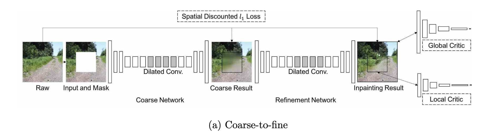
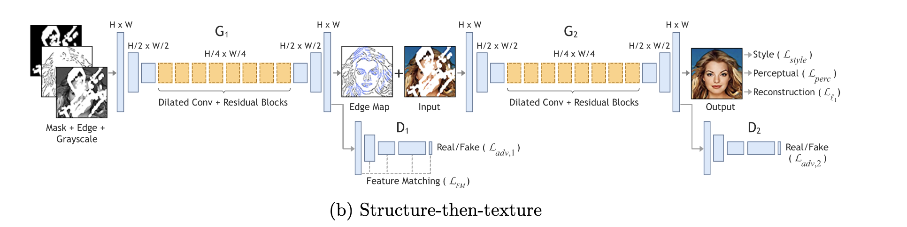
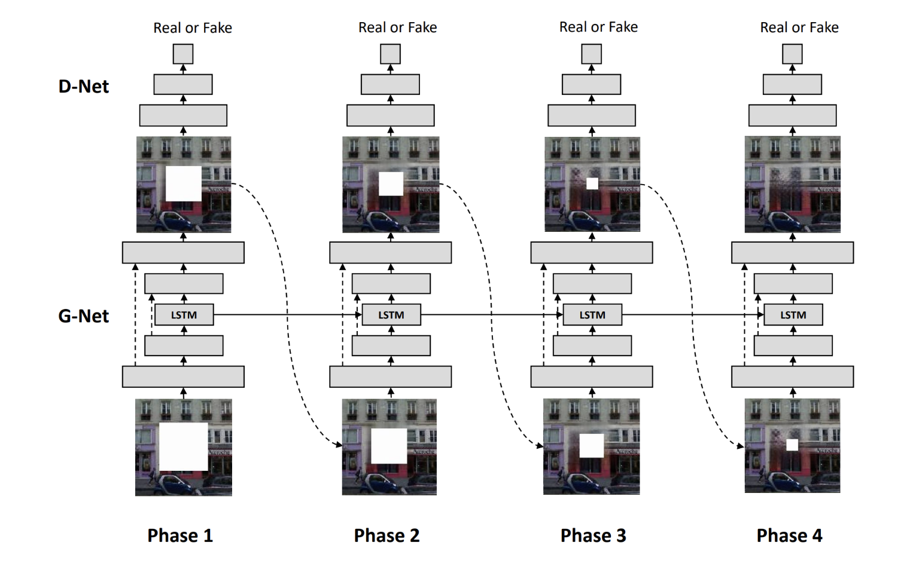
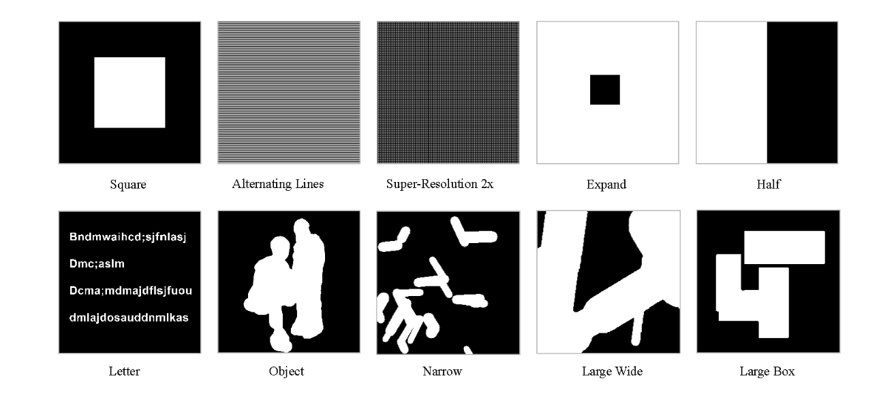

# Deep Learning-based Image and Video Inpainting: A Survey

## ソース
- https://arxiv.org/pdf/2401.03395

## Inpainting
- Image and video inpainting is a classic problem in computer vision and computer graphics, aiming to fill in the plausible and realistic content in the
missing areas of images and video
- 歴史は, PDE-based -> patch-based -> CNN -> GAN -> Diffusion
- Inpaintingはdeterministic image inpaintingとstochastic image inpaintingに分かれる

## Network
- single-shot inpainting framework, coarse to fine, structure-then-texture, Progressive image inpaintingなどがある

(元論文より引用, 上から順にsingle-shot, coarse to fine, structure-then-texture, progressive image inpainting)

## Mask
- mask画像として以下がある

(元論文より引用)

## 英単語
- underconstrained : 不十分に強制された
- relic : 遺物
- concurrent : 同時の、並列の
- intact : 無傷の、傷がない