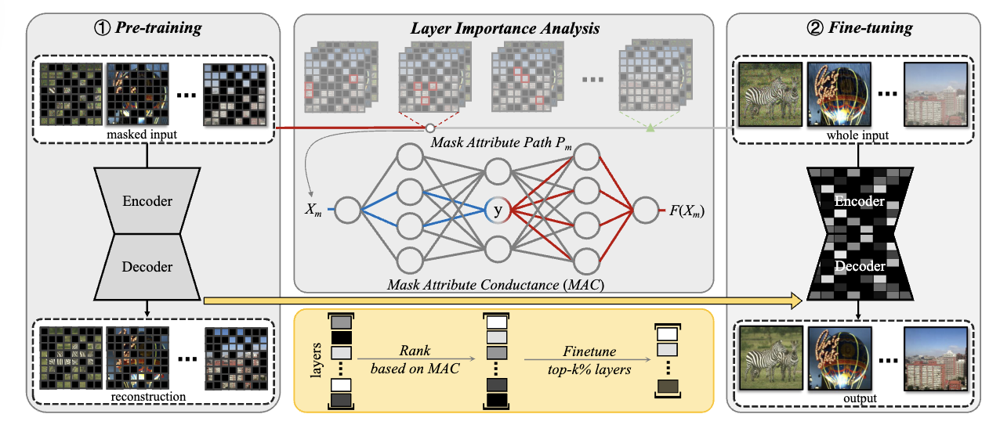

# Restore Anything with Masks: Leveraging Mask Image Modeling for Blind All-in-One Image Restoration(ECCV2024)

- https://arxiv.org/pdf/2409.19403
- https://github.com/Dragonisss/RAM

## 概要
- taskはAll-in-One blind Image Restoration
- 既存手法はimage degradationの特定にfocusを当てている
- この論文ではそうではなく、how to extract intrinsic image information from diverse corrupted imagesにfocusをあてている
- RAM(Restores Anything with Masks)を提案
- RAMは2stageから成る
  - the mask pre-training stage
  - the fine-tuning stage with Mask Attribute Conductance(MAC)

## Related work
- Image Restoration for Multi Degradations
  - AirNet
  - PromptIR
- Mask Image Modeling
  - MAE
  - SimMIM
  - Painter
- Gradient-based Attribution
  - Integrated Gradients(IG)
  - IntInf
  - layer conductance

## 提案手法
- MIMによる事前学習の後にfine-tuning
- fine-tuningする層はmask attribute conductanceで決定

(元論文より引用)

## 英語
- surveillance : 監視
- encompass : 包含する
- harness : 役立てる, 生かす, 用いる
- instrumental : 助けになる、役に立つ
- tailored : 仕立てのきちんとした
- hindrance : 邪魔