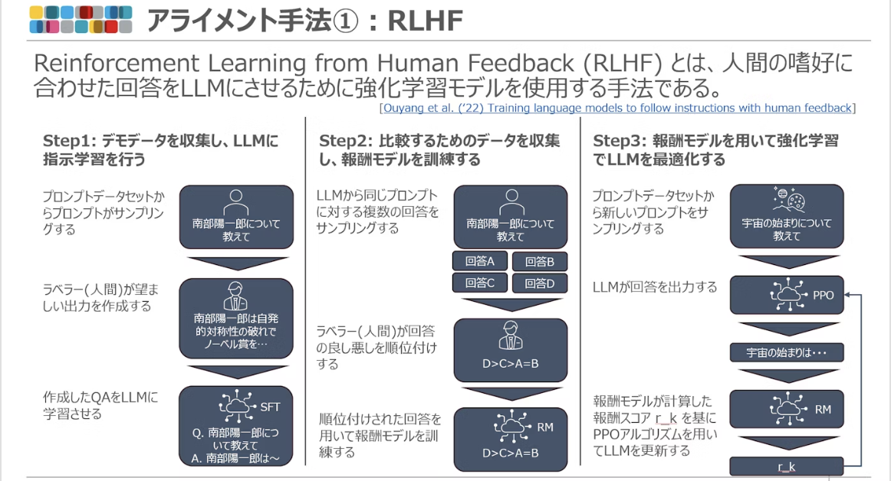
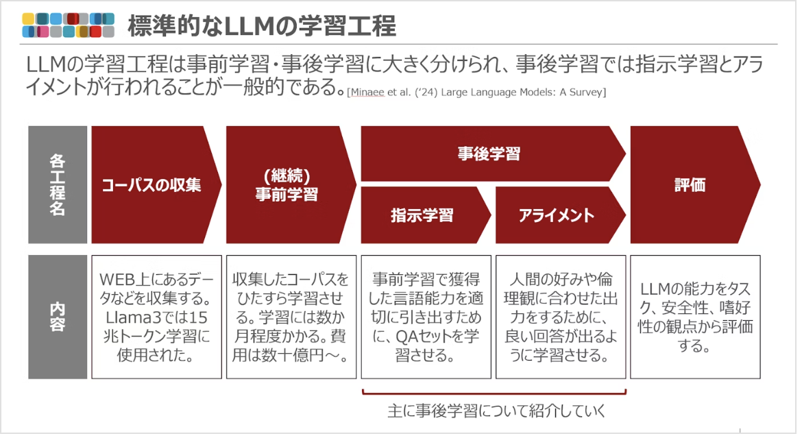

# LLM用語集
- LLM用語について調べたことを書いていく

## Instruction tuning(指示学習)
- 様々なタスクに対してinstruction(指示)と回答のデータセットを学習することでそれらの指示に対してAIから適切な回答を得られるようにする手法
- QAセット

## Alignment(アライメント)
- 人間の好みや倫理観に合わせ、回答を調整する工程
- 2022 年に OpenAI によって Reinforcement Learning from Human Feedback (RLHF) と呼ばれる手法が提案され、その有用性が示された
- 以前の言語モデルの大きな問題点として、差別的な発言をしてしまうということがあったがこの手法により大幅に改善された

## RLHF
- Reinforcement Learning from Human Feedback
- 人間の嗜好に合わせた回答をLLMにさせるために強化学習モデルを使用する手法
- 以下から構成される
  - デモデータを収集してLLMに指示学習を行う
  - 比較するためのデータを収集して報酬モデルを訓練
  - 報酬モデルを用いて強化学習でLLMを最適化

(https://qiita.com/shibu_phys/items/91dc8d600da433d92231 より引用)

## DPO

## LLM学習方法

(https://qiita.com/shibu_phys/items/91dc8d600da433d92231 より引用)
- 以下から成る
  - コーパスの収集
  - 事前学習
  - 事後学習
  - 評価
- 事前学習はLLMに言語を学ばせ言語能力を獲得させるために大量のテキスト(コーパス)を学習させる工程
- 事後学習には指示学習とアライメントがある
- 指示学習はQAテキストを自己教師あり学習させて質問に対して人間が求める回答を出すように学習させる
- アライメントは人間の好みや倫理観に合わせ回答を調整する工程

## Llama
- Metaが開発したLLM
- 「ラマ」
- LLaMA, Llama2, Llama3など

## Vicuna
- オープンソースLLMの1つ
- Llama派生モデル
- ShareGPTのデータを用いてLlamaを調整

## RoPE(Rotary Positional Embeddings)
- 絶対位置埋め込みと相対位置埋め込みの長所を組み合わせたアプローチのこと
- そもそも位置埋め込みとは
  - Transformerモデルでは入力トークンの順序を考慮しない
    - the dog chases the pigとthe pig chases the dogが同じように扱われる
  - これを解決するのが位置埋め込み
  - RoFormer(2021)という論文
  - 絶対位置埋め込みはトークンごとに一意のベクトルを割り当て、単語埋め込みと合算してtransformerレイヤーへの入力を形成する
  - 相対位置埋め込みはトークンの絶対位置埋め込みではなくトークン間の距離に焦点をあて位置オフセットのバイアスを用いて情報を統合
- RoPEは位置ベクトルを追加するのではなく単語ベクトルに回転を適用するというアイディア
  - dogという単語のベクトルを回転させる
- このときの回転角が文中の単語の位置に比例する
- 以下の利点がある
  - ベクトルの安定性
    - 文の終わりにトークンを追加しても文の始めの単語のベクトルに影響を与えない
  - 相対位置の保存
    - pig, dogという単語が異なる文脈で同じ相対距離を保つ場合に、それらのベクトルは同じ量だけ回転される
    - これによりベクトル間の角度と結果としてのドット積が一定に保たれる

## Flan-T5, Flan-PaLM
- Google AIが公開しているオープンソースLLM
- 学習するタスクの数を増やしてfine-tuning
- https://arxiv.org/pdf/2210.11416
