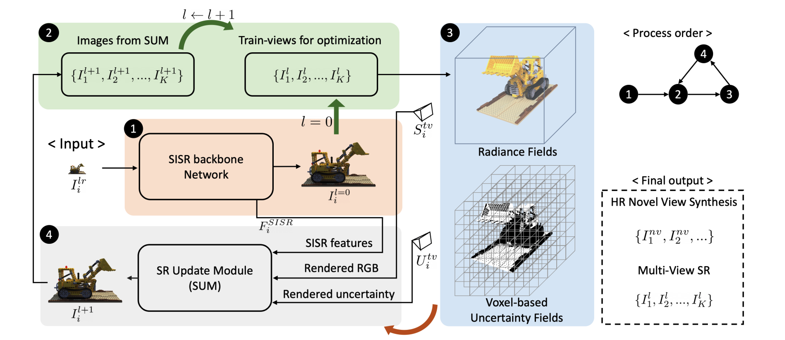
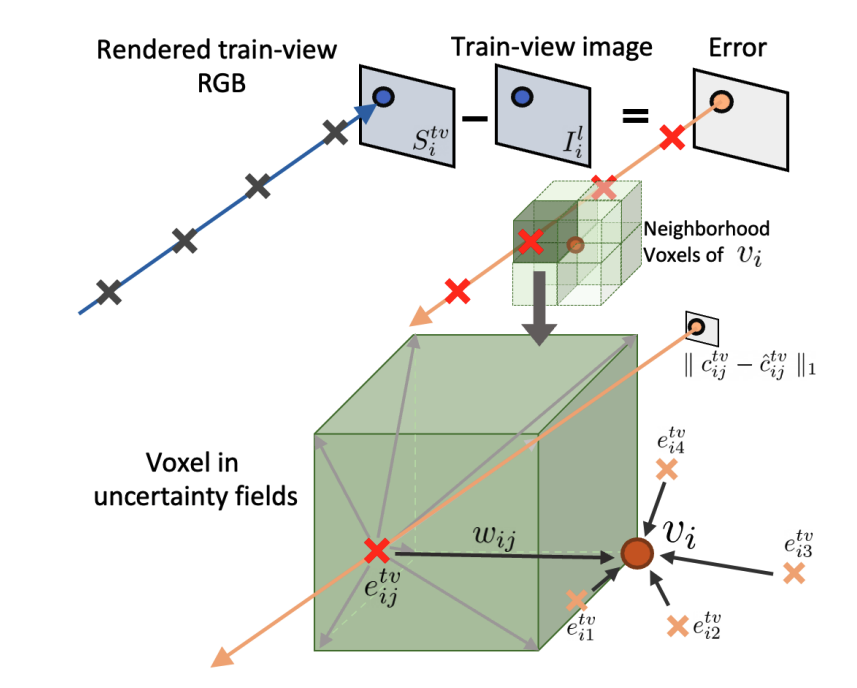
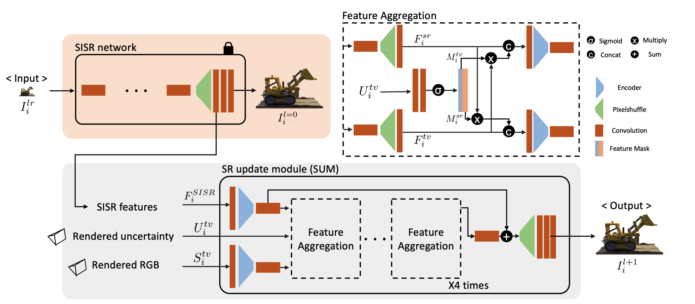

# Cross-Guided Optimization of Radiance Fields with Multi-View Image Super-Resolution for High-Resolution Novel View Synthesis

- https://openaccess.thecvf.com/content/CVPR2023/papers/Yoon_Cross-Guided_Optimization_of_Radiance_Fields_With_Multi-View_Image_Super-Resolution_for_CVPR_2023_paper.pdf

## 概要
- タスクはHRNVS
- CROP(CRoss-guided OPtimization)を提案
- NeRFの学習データセット画像を更新していく
- この更新ネットワークも学習

## CROP

- 図の右上のprocess orderの順にみていく
- まずは学習済みSISRにLRを入れてHRと中間層の出力featureを得る
- このHRでNeRFを学習する
- NeRFからはRGB画像とuncertainty mapの2つを得る
    - 画像のRendered RGBとRendered uncertaintyのこと
    - uncertainty mapはvoxel-based uncertainty fieldから計算(後述)
- feature, rendered RGB, rendered uncertainty mapの3つをSUM(SR Update Module)に入れて新しい画像を生成する
- 得られた画像でまたNeRF学習

### Voxel-based Uncertainty Fields

- 空間をvoxelで切る
- ボクセル上の各頂点に対して、隣接する8つのvoxelからrenderingする際の誤差をもってきて加重平均をとる？
- 誤差のvolume renderingでuncertainty map取得？
$$
\begin{align}
&\begin{split}
e_{ij}^{tv} &= T_{ij}\alpha_{ij}\| c_{ij}^{tv} - \hat{c}_{ij}^{tv} \|_1 \\
v_i &= \frac{\sum_j e_{ij}^{tv}w_{ij}}{\sum_j w_{ij}} \\
u^{tv} &= \sum_{i=1}^k T_i \alpha_i e_i^k, \ \mathrm{where} \ e_i = f_{tri}\left(p_i, V^{(unc)}\right)
\end{split}
\end{align}
$$

### SUM

- SISRのfeatureはPixelshuffle後のもの
- 4つのfeature aggregation層から構成
- feature aggregationはSISR feature, rendered uncertainty, rendered RGBを入力として2つのfeatureを出力
- 最終層ではSISR featureに対応するfeatureのみを取り出してconvとpixelshuffleを通して画像を得る
- このときSUMのlossは以下
$$
L_{SUM} = \| I_i^{gt} - f_{sum}\left(S_i^{tv}, U_i^{tv}, I_i^{lr}\right) \|_1
$$

### optimization for the test set
- NeRFのlossは以下
$$
L_{photo} = \frac{1}{\| R \|}\sum_{r \in R}\| c^{tv}\left(r\right) - \hat{c}^{tv}\left(r\right) \|^2_2
$$