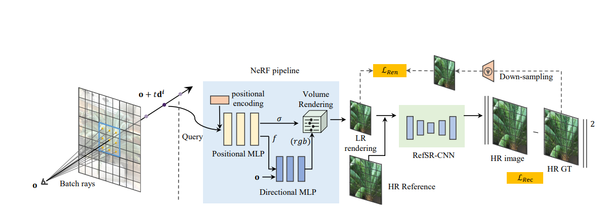
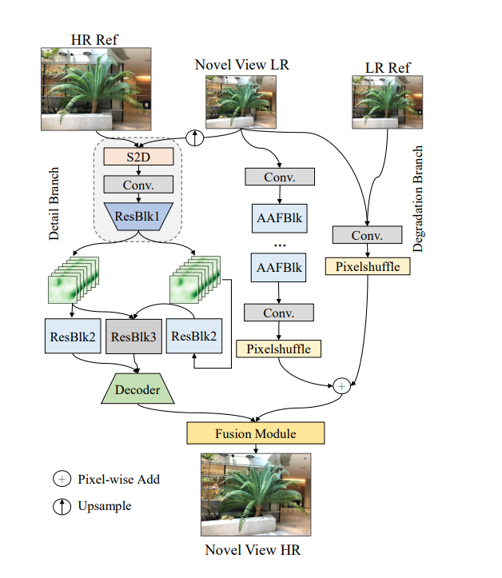

# RefSR-NeRF: Towards High Fidelity and Super Resolution View Synthesis

- https://openaccess.thecvf.com/content/CVPR2023/papers/Huang_RefSR-NeRF_Towards_High_Fidelity_and_Super_Resolution_View_Synthesis_CVPR_2023_paper.pdf

## 概要
- NeRFでLRをrenderingして、それとreferenceをいれてsuper resolutionする
- NeRFがrenderingしたLRとは別の視点の(LR, HR)をreferenceとする
- RefSRにこの3つを入れるとNeRFがrenderingしたLRを超解像したHRが出る
- rayはbatch raysとして複数打ってピクセルではなくパッチ画像を作成する
- lossはHRとそれをdown samplingしたLRの2つで計算

## Related work
- Efficient NeRFとして引用されているもの
  - KiloNeRF
  - NeX
  - DIVeR
  - NSVF
  - FastNeRF
  - Efficient-NeRF
  - SNeRG
- RefSRとして引用されているもの
  - CrossNet : optical flow使う
  - TTSR : transformer使う(LRとreferenceをquery, keyとする)
  - C2-Matching : 蒸留
## RefSR-NeRF
- 図を見ればわかる
- NeRFは図の通り普通のNeRF
- lossは2つとる

(元論文より引用)
## RefSR architecture
- 図の通り

(元論文より引用)
## 英語
- extraordinary : 並外れた
- incur : 招く
- parsimony : 質素さ、倹約
- deft : 器用な、手際のよい、巧みな
- off-the-shelf : 既製品の、すぐに使える