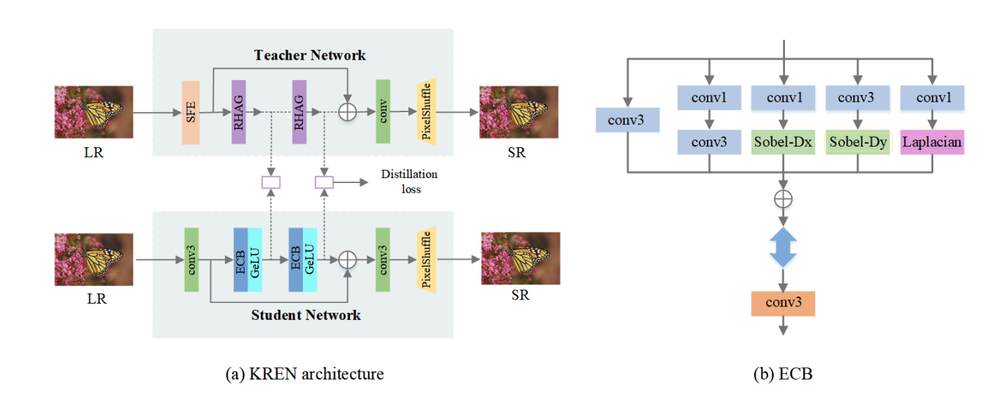

# Real-Time 4K Super-Resolution of Compressed AVIF Images AIS 2024 Challenge Survey

## 概要
- SRのコンペの手法まとめ
- 制限時間があるから基本的にconvolution
- 代表的な手法は以下の4つ
    - Re-parameterization
    - Pixel shuffle and unshuffle
    - Multi-stage Training
    - Knowledge distillation
- 3のMethods and Teamsに大量に手法がある

## 前提知識
### Re-parameterization
- https://dev.classmethod.jp/articles/yolov7-architecture-overall/
- https://arxiv.org/abs/2101.03697

 
## 3.10 A light weight Super-Resolution Algorithm Based on Re-Parameterization

- 2つのCNNと2つのRe-Parameterization layerから構成されるnetwork
- 右の図のECBがre-parameterizationの説明
- HATをteacherとしてdistillation