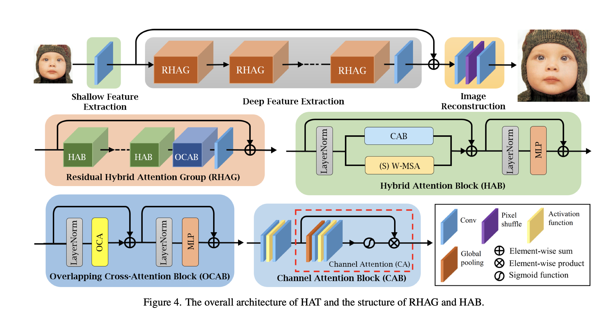

# HAT-L(Hybrid Attention Transformer)
## 論文ソース
  - [[https://arxiv.org/pdf/2205.04437.pdf|Activating More Pixels in Image Super-Resolution Transformer]]

## 概要
  - Super ResolutionタスクでSOTA達成(SwinIRが当時のトップ)
  - LAM(出力高画質画像のどの領域が入力低画質画像の影響を受けているかを可視化するツール)を使用して分析した
    - SwinIRは局所領域のみを判断根拠にしていた(Fig2)
    - 自分たちは全体を判断根拠にするようにした(HABで)
  - 各層の途中特徴マップを見て分析した(超解像の過程観察)
    - SwinIRは途中でピクセルになっている領域がある(超解像が同時に行われない？？):blocking artifacts in the intermediate feature
      - window prtition mechanismの影響らしい
    - 自分たちはcross-window information interactionsをstrengthenしたらしい   
## 前提知識 

### Self-AttentionとCross-Attentionの違い
  - query,key,valueの計算方法が違う
    - selfは1つの前層から得る
      - $Q=XW^Q, K=XW^K, V=XW^V$ 
    - crossは2つの前層からそれぞれquery,(key,value)を得る
      - $Q=XW^Q, K=YW^K, V=YW^V$ 
  - (補足)Masked Self Attentionについて
    - Masked Self-Attention：自己回帰生成（順に要素を予測していくタスク）などに用いられる場合、Self-Attentionの各要素が自身より未来の要素を参照できないようにする必要がある
    - Attention Matrixに三角状のマスクを適用し、各要素が未来の要素にアクセスできないようにすることで、過去と現在の情報のみから未来の情報を予測できるように学習させる

### PSNR
  - Super Resolutionにおける評価方法の一つ
  - $[0,\infty)$で大きいほど良い
  - Peak Signal To Noise Ratio
  - MSE:Mean Square Error:平均二乗誤差
$$
10
\log_{10}
{
\frac
{255^2}
{
\rm{MSE}
\left(
\rm{I_{SR}},
\rm{I_{HR}}
\right)
}
}
$$


## HAT-Lの構造



- RHAG:Residual Hybrid Attention Group
- HAB:Hybrid Attention Block
- OCAB:Overlapping Channel Attention Block 
- CAB:Channel Attention Block
- (S)W-MSA:Shifted Window-based Multi Self Attention
- MLP:Multi Layer Perceptron
  - 2層GELU 

### 全体
  - SwinIRと全く同じ3層アーキテクチャ 
    - Shallow Feature Extraction
    - Deep Feature Extraction
    - Image Reconstruction
  - 論文ではShallow FeatureとImage Reconstruction moduleに一切言及していないのでSwinIRと同じだと思われる
#### Shallow Feature
  - 1層Convolution

#### Deep Feature Extraction
  - RHAG複数層と最後の1層Convolutionから成る
    - SwinIRはRSTB(Residual Swin Transformer Block) 
#### Image Reconstruction
  - sub-pixel convolution

### Residual Hybrid Attention Group(RHAG)
  - HAB複数とOCAB1層とConvolution1層と残差接続から成る 

### HAB(Hybrid Attention Block)
  - 画像を見るとSwin Transformerの(S)W-MSAに並列してCABが追加された構造になっていることがわかる
    - CABはただのCNN
    - TransformerとCNNを同時に使っていることがHybridの由来だと思われる
  - CABと(S)W-MSAの和の重みは$\alpha$で調整
$$
X_N = {\rm{LN}}\left(X\right)\\
X_M = \text{(S)W-MSA}\left(X_N\right)+\alpha {\rm{CAB}}\left(X_N\right)+X\\
Y = {\rm{MLP}}\left({\rm{LN}}\left(X_M\right)\right)+X_M
$$     
### CAB(Channel Attention Block)
  - 全体はConv->GELU->Conv->GlobalPooling->Conv->GELU->Conv->Sigmoid->残差接続(アダマール積)
  - Channel AttentionはGlobalPooring以降のこと
### OCAB(Overlapping Cross Attention Block)
  - 画像を見るとSwin Transformer Blockのself attentionがcross attentionになっていることがわかる
  - Overlapping Cross Attentionは、windowに分割する時にQはそのままでK,Vを拡大してからAttentionをとる(Q,(K,V)でそれぞれ計算方法が違うからCross Attention、というよりK,Vを拡大することではみでた部分がQにはないからcross attention)
    - 入力$X$から行列かけて$X_Q,X_K,X_V \in \mathbb{R}^{H  \times W \times C}$を得る
    - window分割して$\frac{HW}{M^2}\times M^2 \times C$の形状を得る
      - $Q$はこれで終わり
    - $K,V$は$\frac{HW}{M^2}$個のwindowごとに$(1+\gamma)$倍して$M_o \times M_o$に拡大
      - $M_o = \left(1+\gamma\right) \times M$ 
    - こうして得た$Q,K,V$でCross Attention計算
$$
{\rm{Attention}}\left(Q,K,V\right) = {\rm{SoftMax}}
\left(
\frac
{QK^T}
{\sqrt{d}}
+B
\right)
V
$$

  - $Q$:$\frac{HW}{M^2}\times M^2 \times C$
  - $K$:$\frac{HW}{M^2}\times M_o^2 \times C$
  - $V$:$\frac{HW}{M^2}\times M_o^2 \times C$
    - $\frac{HW}{M^2}$個ごとにattentionを計算するのでAttention mapは$M^2 \times M_o^2$になり、Attentionは$M^2 \times C$


## ソースコード
### ソース
  - Github
    - https://github.com/XPixelGroup/HAT
  - 事前学習済みモデルのpthファイル
    - https://drive.google.com/drive/folders/1HpmReFfoUqUbnAOQ7rvOeNU3uf_m69w0
### ソースコードフォルダ構成
```
.
├── HAT
│   ├── LICENSE
│   ├── README.md
│   ├── VERSION
│   ├── cog.yaml
│   ├── datasets
│   │   └── README.md
│   ├── experiments
│   │   └── pretrained_models
│   │       └── README.md
│   ├── figures
│   │   ├── Comparison.png
│   │   ├── Performance_comparison.png
│   │   └── Visual_Results.png
│   ├── hat
│   │   ├── __init__.py
│   │   ├── archs
│   │   │   ├── __init__.py
│   │   │   ├── discriminator_arch.py
│   │   │   ├── hat_arch.py
│   │   │   └── srvgg_arch.py
│   │   ├── data
│   │   │   ├── __init__.py
│   │   │   ├── imagenet_paired_dataset.py
│   │   │   ├── meta_info
│   │   │   │   └── meta_info_DF2Ksub_GT.txt
│   │   │   └── realesrgan_dataset.py
│   │   ├── models
│   │   │   ├── __init__.py
│   │   │   ├── hat_model.py
│   │   │   ├── realhatgan_model.py
│   │   │   └── realhatmse_model.py
│   │   ├── test.py
│   │   └── train.py
│   ├── options
│   │   ├── test
│   │   │   ├── HAT-L_SRx2_ImageNet-pretrain.yml
│   │   │   ├── HAT-L_SRx3_ImageNet-pretrain.yml
│   │   │   ├── HAT-L_SRx4_ImageNet-pretrain.yml
│   │   │   ├── HAT-S_SRx2.yml
│   │   │   ├── HAT-S_SRx3.yml
│   │   │   ├── HAT-S_SRx4.yml
│   │   │   ├── HAT_GAN_Real_SRx4.yml
│   │   │   ├── HAT_SRx2.yml
│   │   │   ├── HAT_SRx2_ImageNet-pretrain.yml
│   │   │   ├── HAT_SRx3.yml
│   │   │   ├── HAT_SRx3_ImageNet-pretrain.yml
│   │   │   ├── HAT_SRx4.yml
│   │   │   ├── HAT_SRx4_ImageNet-LR.yml
│   │   │   ├── HAT_SRx4_ImageNet-pretrain.yml
│   │   │   └── HAT_tile_example.yml
│   │   └── train
│   │       ├── train_HAT-L_SRx2_ImageNet_from_scratch.yml
│   │       ├── train_HAT-L_SRx2_finetune_from_ImageNet_pretrain.yml
│   │       ├── train_HAT-L_SRx3_ImageNet_from_scratch.yml
│   │       ├── train_HAT-L_SRx3_finetune_from_ImageNet_pretrain.yml
│   │       ├── train_HAT-L_SRx4_ImageNet_from_scratch.yml
│   │       ├── train_HAT-L_SRx4_finetune_from_ImageNet_pretrain.yml
│   │       ├── train_HAT-S_SRx2_from_scratch.yml
│   │       ├── train_HAT-S_SRx3_from_scratch.yml
│   │       ├── train_HAT-S_SRx4_finetune_from_SRx2.yml
│   │       ├── train_HAT_SRx2_ImageNet_from_scratch.yml
│   │       ├── train_HAT_SRx2_finetune_from_ImageNet_pretrain.yml
│   │       ├── train_HAT_SRx2_from_scratch.yml
│   │       ├── train_HAT_SRx3_ImageNet_from_scratch.yml
│   │       ├── train_HAT_SRx3_finetune_from_ImageNet_pretrain.yml
│   │       ├── train_HAT_SRx3_from_scratch.yml
│   │       ├── train_HAT_SRx4_ImageNet_from_scratch.yml
│   │       ├── train_HAT_SRx4_finetune_from_ImageNet_pretrain.yml
│   │       ├── train_HAT_SRx4_finetune_from_SRx2.yml
│   │       ├── train_Real_HAT_GAN_SRx4_finetune_from_mse_model.yml
│   │       └── train_Real_HAT_SRx4_mse_model.yml
│   ├── predict.py
│   ├── requirements.txt
│   ├── results
│   │   └── README.md
│   ├── setup.cfg
│   └── setup.py
├── LICENSE
├── README.md
├── VERSION
├── cog.yaml
├── datasets
│   └── README.md
├── experiments
│   └── pretrained_models
│       └── README.md
├── figures
│   ├── Comparison.png
│   ├── Performance_comparison.png
│   └── Visual_Results.png
├── hat
│   ├── __init__.py
│   ├── archs
│   │   ├── __init__.py
│   │   ├── discriminator_arch.py
│   │   ├── hat_arch.py
│   │   └── srvgg_arch.py
│   ├── data
│   │   ├── __init__.py
│   │   ├── imagenet_paired_dataset.py
│   │   ├── meta_info
│   │   │   └── meta_info_DF2Ksub_GT.txt
│   │   └── realesrgan_dataset.py
│   ├── models
│   │   ├── __init__.py
│   │   ├── hat_model.py
│   │   ├── realhatgan_model.py
│   │   └── realhatmse_model.py
│   ├── test.py
│   ├── train.py
│   └── version.py
├── hat.egg-info
│   ├── PKG-INFO
│   ├── SOURCES.txt
│   ├── dependency_links.txt
│   ├── not-zip-safe
│   ├── requires.txt
│   └── top_level.txt
├── options
│   ├── test
│   │   ├── HAT-L_SRx2_ImageNet-pretrain.yml
│   │   ├── HAT-L_SRx3_ImageNet-pretrain.yml
│   │   ├── HAT-L_SRx4_ImageNet-pretrain.yml
│   │   ├── HAT-S_SRx2.yml
│   │   ├── HAT-S_SRx3.yml
│   │   ├── HAT-S_SRx4.yml
│   │   ├── HAT_GAN_Real_SRx4.yml
│   │   ├── HAT_SRx2.yml
│   │   ├── HAT_SRx2_ImageNet-pretrain.yml
│   │   ├── HAT_SRx3.yml
│   │   ├── HAT_SRx3_ImageNet-pretrain.yml
│   │   ├── HAT_SRx4.yml
│   │   ├── HAT_SRx4_ImageNet-LR.yml
│   │   ├── HAT_SRx4_ImageNet-pretrain.yml
│   │   └── HAT_tile_example.yml
│   └── train
│       ├── train_HAT-L_SRx2_ImageNet_from_scratch.yml
│       ├── train_HAT-L_SRx2_finetune_from_ImageNet_pretrain.yml
│       ├── train_HAT-L_SRx3_ImageNet_from_scratch.yml
│       ├── train_HAT-L_SRx3_finetune_from_ImageNet_pretrain.yml
│       ├── train_HAT-L_SRx4_ImageNet_from_scratch.yml
│       ├── train_HAT-L_SRx4_finetune_from_ImageNet_pretrain.yml
│       ├── train_HAT-S_SRx2_from_scratch.yml
│       ├── train_HAT-S_SRx3_from_scratch.yml
│       ├── train_HAT-S_SRx4_finetune_from_SRx2.yml
│       ├── train_HAT_SRx2_ImageNet_from_scratch.yml
│       ├── train_HAT_SRx2_finetune_from_ImageNet_pretrain.yml
│       ├── train_HAT_SRx2_from_scratch.yml
│       ├── train_HAT_SRx3_ImageNet_from_scratch.yml
│       ├── train_HAT_SRx3_finetune_from_ImageNet_pretrain.yml
│       ├── train_HAT_SRx3_from_scratch.yml
│       ├── train_HAT_SRx4_ImageNet_from_scratch.yml
│       ├── train_HAT_SRx4_finetune_from_ImageNet_pretrain.yml
│       ├── train_HAT_SRx4_finetune_from_SRx2.yml
│       ├── train_Real_HAT_GAN_SRx4_finetune_from_mse_model.yml
│       └── train_Real_HAT_SRx4_mse_model.yml
├── predict.py
├── requirements.txt
├── results
│   └── README.md
├── setup.cfg
└── setup.py

28 directories, 135 files
```