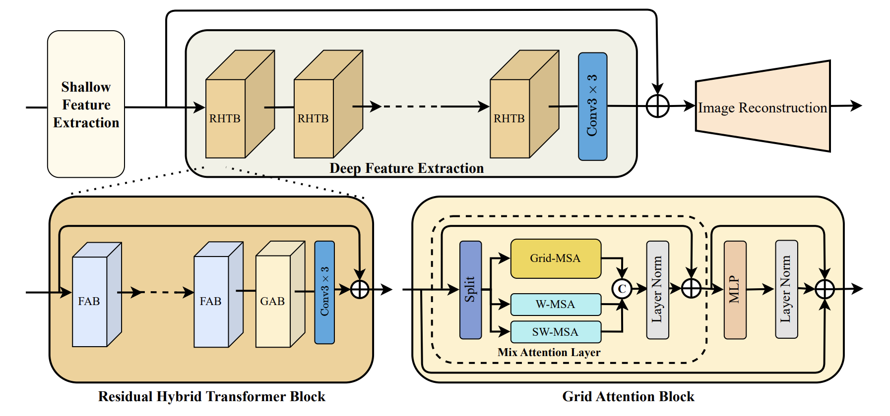
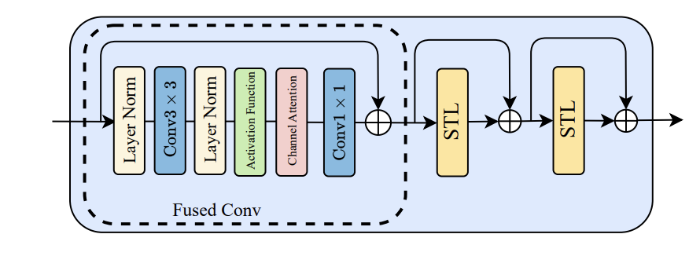
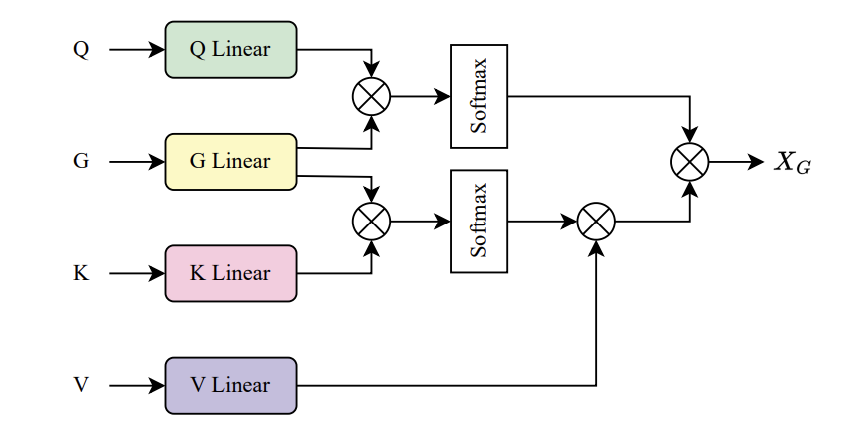

# HMANet: Hybrid Multi-Axis Aggregation Network for Image Super-Resolution

## 概要
- HMA(Hybrid Multi-axis Aggregation network)を提案
- RHTB(Residual Hybrid Transformer Blocks)とGAB(Grid Attention Blocks)から構成される

## 提案手法

### 全体像
- 以下の図のようにHATなどと同じくshallow feature extraction, deep feature extraction, image reconstructionから構成される
- deep feature extractionは複数のRHTB(Residual Hybrid Transformer Blocks)から構成される
- RHTBは複数のFABと1層のGABから構成される

### FAB
- FABはChannel Attentionと普通のAttention構造
  - STLはSwin Transformer Layerのこと

### Grid Attention
- $X$に対して線形層を通して$Q,G,K,V$を得る
- このときGrid Attentionは以下で定まる

$$
\begin{align}
&\begin{split}
\hat{X} &= \mathrm{SoftMax}\left(\frac{G K^{\top}}{d}+B\right)V \\
\mathrm{Attention}\left(Q,G,\hat{X}\right) &= \mathrm{SoftMax}\left(\frac{QG^{\top}}{d}+B\right)\hat{X}
\end{split}
\end{align}
$$

### GAB(Grid Attention Block)
- channel方向に分けてGrid Attention, Shift window Attention, window Attentionを計算後にchannel方向にconcatenateするというもの
- 分ける際の比率は$2:1:1$
- 入力を$F_{in} \in \mathbb{R}^{H \times W \times C}$とする
- これを$F_G \in \mathbb{R}^{H \times W \times \frac{C}{2}}, F_{W_1} \in \mathbb{R}^{H \times W \times \frac{C}{4}}, F_{W_2} \in \mathbb{R}^{H \times W \times \frac{C}{4}}$に分割
- このときMix Attention Layerの出力は以下

$$
\begin{align}
&\begin{split}
X_{W_1} &= \mathrm{W-MSA}\left(F_{W_1}\right)\\
X_{W_2} &= \mathrm{SW-MSA}\left(F_{W_2}\right)
\\
X_{G} &= \mathrm{Grid-MSA}\left(F_{G}\right)
\end{split}
\\
X_{\mathrm{MAL}} &= \mathrm{LN}\left(\mathrm{Cat}\left(X_{W_1}, X_{W_2}, X_G\right)\right)+F_{in}
\end{align}
$$