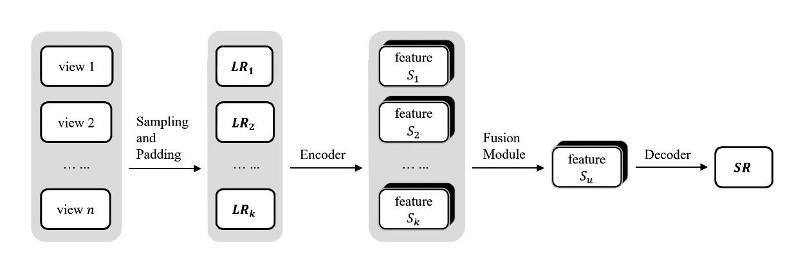
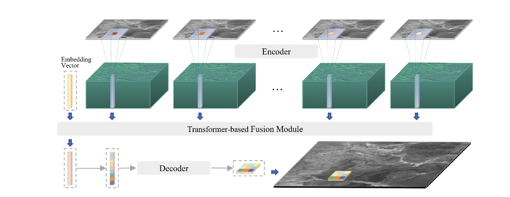
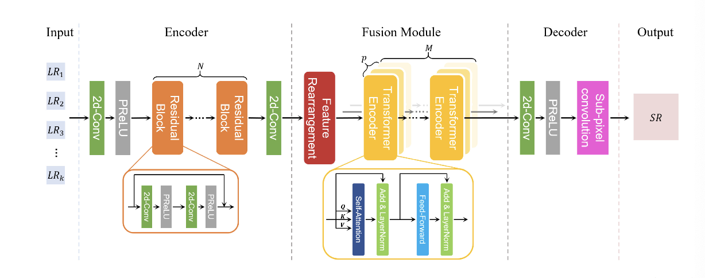

# TR-MISR: Multiimage Super-Resolution Based on Feature Fusion With Transformers

## ソース
- https://ieeexplore.ieee.org/document/9684717

## 概要
- MISR(Muti Image Super Resolution)タスクにTransformer導入

## Single Image Super Resolution
- SISR
- image to image

## Video Super resolution
- VSR
- video to video
- (a sequence of low resolution frames) -> (a sequence of high resolution frames)

## Multi image Super Resolution
- MISR
- multiple low resolution images -> a high resolution image
- 具体的に、入力を$k$個の低画質画像$\{\mathrm{LR}_i\}_{i=1}^k \in \mathbb{R}^{C\times W \times H}$とした時に高画質画像$\mathrm{HR}\in\mathbb{R}^{C \times rW \times rH}$を出力するもの

## MISR method
- MISRの手法はだいたいpre-processing module, encoder, fusion module, decoderから構成される

(論文より引用)

## 提案手法
- EncoderはResNet
- Fusion ModuleにTransformerを導入
- Encoderから得られた特徴量に加えてEmbedding vectorを先頭につける
  - これも学習可能
- DecoderはSISRと同じくSubpixel convolution(pixel shuffle)

(論文より引用)