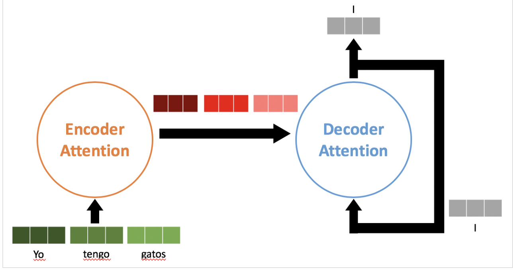
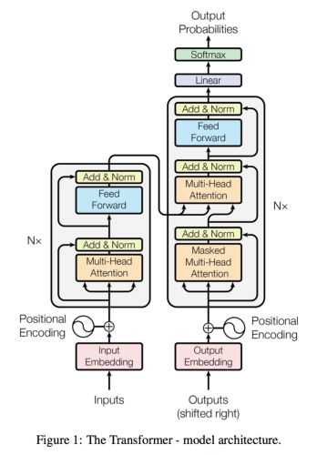
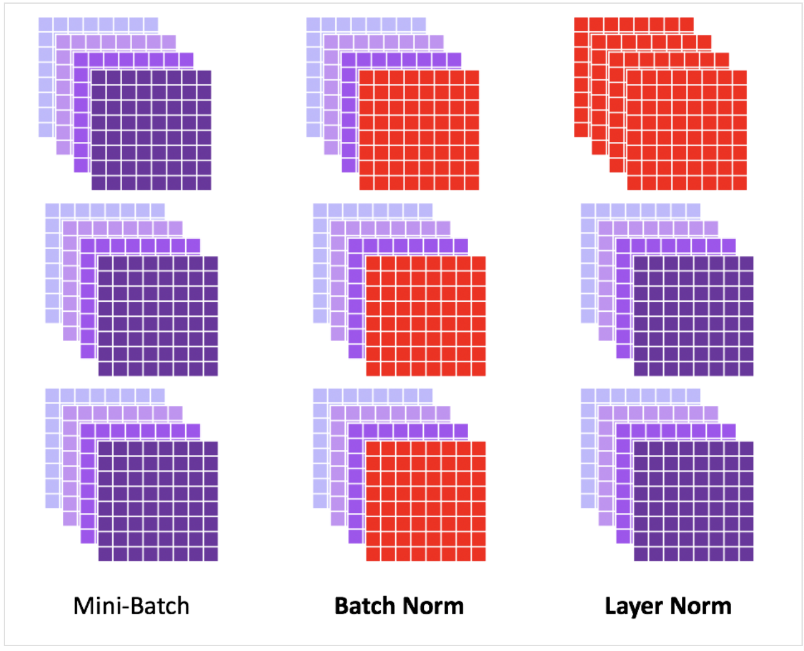

# Transformer
## 論文ソース
  - [Attention Is All You Need](https://arxiv.org/abs/1706.03762)

## 概要
  - RNNとCNNを使わずにAttentionのみを使用したEncoder-Decoderモデル
    - 計算量も精度も改善
    - RNNないから並列計算可能(学習時) 
  - 以下はスペイン語-英語の翻訳タスクに使う場合の図
    - Encoderへの入力"Yo tengo gatos"(スペイン語)
    - Decoder学習時
      - 入力:Encoderの出力(潜在表現)と"I love cats"
      - 出力:次の単語予測
    - Decoder推論時
      - Encoderに"Yo tengo gatos"を入れて出力された潜在表現を入力として"I"を出力する
      - 次は"I"を下に持ってきて"love"を出力 
      - 以下、Decoderの出力を再度入力するということを繰り返して単語を出力し続ける
      - 最後に特別な終了文字が出力されるまで繰り返す 

## 前提知識

### Attention
  - 入力:Query, Key, Valueの3つのベクトル($Q,K,V$)
  - 出力: $V$ の加重和
    - つまり $AV$ 
    - $A$ は $Q,K$ から計算される、これがAttention map
  - 以下の式で定まる
$${\rm{Attention}}\left(Q,K,V\right) = {\rm{softmax}}\left( \frac{QK^T}{\sqrt{d_k}}\right)V$$ 
$$Q \in \mathbb{R}^{m\times d_k}, K \in \mathbb{R}^{ n \times d_k}, V \in \mathbb{R} ^ {n \times d_v}$$
(queryとkeyが同じ次元をもつ、queryはm個で(Key,Value)のペアはn個)
  - Attention map : ${\rm{softmax}}\left( \frac{QK^T}{\sqrt{d_k}}\right)\in \mathbb{R}^{m \times n}$
  - softmaxは行方向の和が1になるようにする
### Multi Head Attention
- 以下の式で定まる
$\rm{MultiHead}(Q,K,V) = \rm{Concat}\left(\rm{head}_1,\cdots, \rm{head}_h\right)W^O$
$\rm{where} \quad \rm{head}_i = \rm{Attention}\left(QW_i^Q,KW_i^K,VW_i^V\right)$
$W_i^Q \in \mathbb{R}^{d_{model}\times d_k},W_i^K \in \mathbb{R}^{d_{model}\times d_k},W_i^V \in \mathbb{R}^{d_{model}\times d_v},W_i^O \in \mathbb{R}^{hd_v\times d_k}$
  1.  query,key,valueに対してh個の重みWを用意して変換した後にAttentionを取る
  2. 得られたh個のベクトルをつなげる($m\times hd_v$になる)
  3. $W^O$ で次元戻す

## Transformerの構造
  - 以下がTransformerの全体像

### Encoder-Decoderモデル
  - 左がEncoder,右がDecoder
  - 英語からスペイン語に翻訳するようなものであれば、入力(ストップワード削除済み)はそれぞれ
    - Encoder:I have cats
    - Decoder:Yo tengo gatos
### Multi Head Attention
  - 図でMHAの前に矢印が1本から3本になっているが、これは以下のようになっている
    - 前層の出力$X$に対して$Q=XW^Q,K=XW^K,V=XW^V$としてquery,key,valueを生成 
  - MHAは全部で以下の3箇所である
    - 1. EncoderからDecoderに繋がっている中央の矢印
      - Query:Decoder前層の出力
      - Key,Value:Encoderの最終出力
    - 2. Encoderの中にあるSelf Attention
      - Query,Key,Value:前層の出力 
    - 3. Decoderの中にあるMasked Self Attention
      - Query,Key,Value:前層の出力 
      - Maskしてdecoderの入力(正解データ)をそのまま出力しないようにしている

### Feed Forward
  - Position-wise Feed Forward Networkのこと
  - Position-wiseとは各単語ごとに独立してニューラルネットワークがあるという意味(重みは共有)
  - 以下のような2層のNNで非線型関数としてはReLUを使用している
$${\rm{FFN}}(x) = {\rm{max}}(0, xW_1+b_1)W_2 + b_2$$
### Positional Encoding
  - RecurrenceやConvolutionがないことから単語の順番が関係なくなってしまう
    - "I love cats"と"cats love I"が同じになってしまう
  - そこでPositional Encodingを使う
  - 一番最初にこのモデルに単語の分散表現を入力するときに単語位置に一意の値を各分散表現に加算する
  - 加算方法は以下

$
{\rm{PE}}_{(pos,2i)} = {\rm{sin}}\left(pos/10000^{2i/d_{model}}\right)
\\
{\rm{PE}}_{(pos,2i+1)} = 
{\rm{cos}}\left(pos/10000^{2i+1/d_{model}}\right)
$

  - $pos$は単語の位置,$i$は次元
### Add & Norm
  - Add:Residual Connection
    - 前層の出力と入力を足す
  - Norm:Layer Normalizetion 
    - Batch Normalizationは同一チャネルをミニバッチに跨って正規化
    - Layer Nomalizationは各データそれぞれで正規化する
    - 以下の図がわかりやすい

