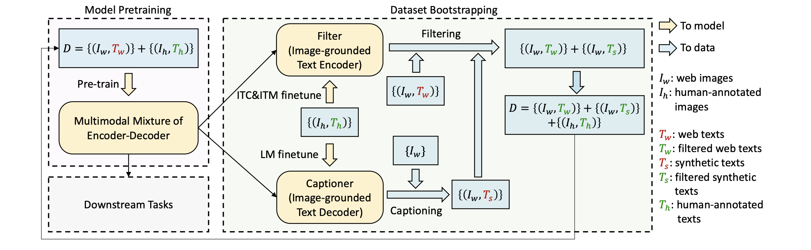

# BLIP: Bootstrapping Language-Image Pre-training for Unified Vision-Language Understanding and Generation
- https://arxiv.org/pdf/2201.12086

## 概要
- タスクはVLP(Vision-Language Pre-training)
- MED, CapFiltを提案
- MED(Multimodal mixture of Encoder-Decoder)はVLPのモデル
- CapFiltはVLPのためのデータセットを改良するモデル
- webから自動取得したデータが本当に正しいか(Fliter)
- 画像からデータセット自動生成(Captioner)

## MED

- Bi Self-AttはBidirectional Self Attention
    - 普通のself attentionのこと
    - 現在の状態が過去の状態と未来の状態の両方から計算されることからbidirectional
- Causal Self-AttはCausal Self Attention(因果的自己注意機構)
    - 現在の状態が過去の状態からのみ計算されるからCausal self attention
    - decoderは次トークン予測をするのでattentionを計算するときに未来部分をマスクしないといけないため
- 図のように左から順にImage Encoder, Text Encoder, Image-grounded Text encoder, Image-grounded Text decoderの4つから構成されており、すべてtransformer
    - Image EncoderはViTでimageをpatchに分割して[CLS]トークンを先頭につけて入力
    - Text Encoderはtextに[CLS]トークンを付与して入力, cross attention使わない
    - Image-grounded Text encoderはtextに[Encode]トークンを付与
    - Image-grounded Text decoderはtextに[Decode]トークンを付与, self attentionはcausalにする
- この事前学習の目的関数はITC, ITM, LMの3つ
    - ITC : Image-Text Contrastive loss
        - image encoderとtext encoderの出力で対照学習
        - 正例(ペア)を最大化、負例(ペアでない)を最小化
    - ITM : Image-Text matching
        - これは二値分類タスク
        - 画像とテキストが与えられたときにペア(positive)かペアでない(negative)か
        - image-grounded text encoderの内部でcross attentionで画像とテキストの類似時計算
        - 得られた出力(feature)にITM head(2値分類用ネットワーク)をつけてこのタスクを解く
        - 得られたラベルからITM lossを計算
    - LM : Language Modeling loss
        - これは生成系タスクで画像のキャプション生成
        - 画像が与えられたときにその画像の説明文を生成するタスク
- 以上のように2つの入力(画像, テキスト)に対して4つのネットワークから構成されて同時に3つのタスクを解いている

## CapFilt

- 図を見ればわかる
- Filter, Captionerという2つのネットワークから構成
- 左上が入力されるデータセットであり、multimodal mixture of encoder decoderが上述のMED
- データセットは人が作成したものとwebから自動取得したものがある
- MEDのimage-grounded text encoder(4つのうち3番目)がFilter
- MEDのimage-grounded text decoder(4つのうち4番目)がCaptioner
- FilterとCaptionerを人が作成したデータセットでfine-tuningする
- データセットとしてwebから得たものをFilterに入れたときに、ITMをさせてペアとして正しいか判定させる
    - negativeと出力された場合は使わない
    - web自動取得データセットのフィルタリングという役割を担う
- データセットとしてwebから得た画像だけをCaptionerに入れてキャプションを生成させる
    - 生成されたキャプションテキストと元画像をペアとしてfilterにいれる
    - filterがpositiveと判断したらデータセットに加える

## 英語
- delineate : 輪郭を描く
