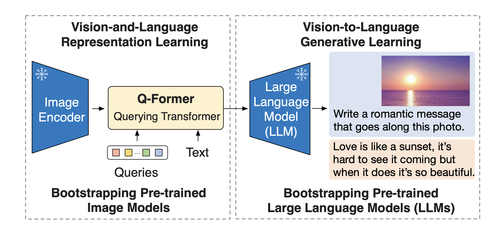
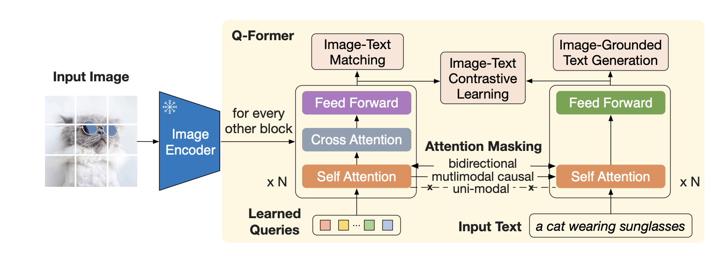
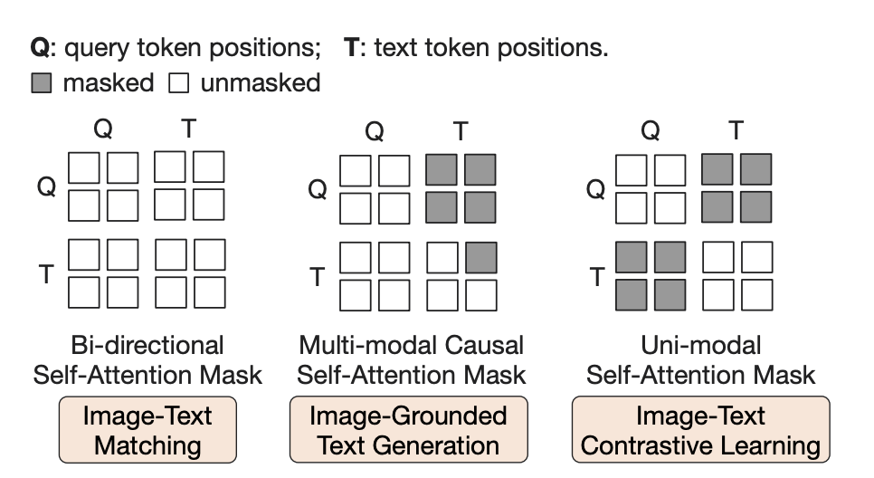
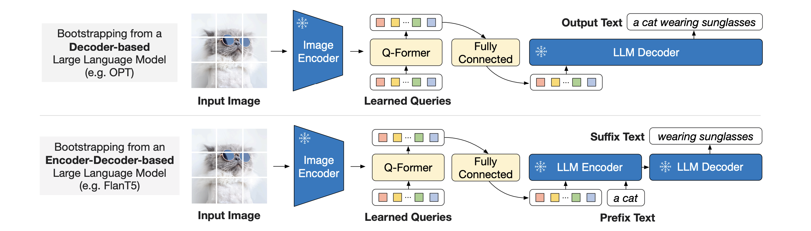

# BLIP-2: Bootstrapping Language-Image Pre-training with Frozen Image Encoders and Large Language Models

# 概要
- タスクはvisiaon and language
- Q-Former(Quering Transformer)を提案
- Catastrophic forgettingを避けるためにimage encoder, LLMはfreezeさせるべき
- そのfreezeさせた2つのモデルの仲介としてQ-Formerを提案
- Q-Formerのみ学習

## Q-Former

- Q-Formerは上図のような普通のTransformer
- 2つ書かれているがattention共有されている(対照学習していることをわかりやすくするために2つ書かれているだけだと思われる)
- 入力として学習対象のqueryがある
- 事前学習のタスクはBLIPと同様に以下の3つ
    - Image-Text Matching(ITM)
    - Image-Text Contrastive Learning(ITC)
    - Image-Grounded Text Generation
- self attention計算は、タスクに併せてmaskが3パターンある
    - bidirectional : ITM
        - maskなし
    - multimodal causal : text generation
        - queryはqueryのみを参照してtextを参照しない
        - textは過去のtextのみを参照
    - uni-modal : ITC
        - queryはqueryのみを参照
        - textはtextのみを参照
        - 対照学習のために互いが互いを見てはいけない

- Q-Formerから得られたqueryはFFNを通してtext embeddingの次元にprojectionする
- 得られたものをLLMにいれる
- 学習時にLLMはdecoderベースとencoder-decoderベースの両方を使用
