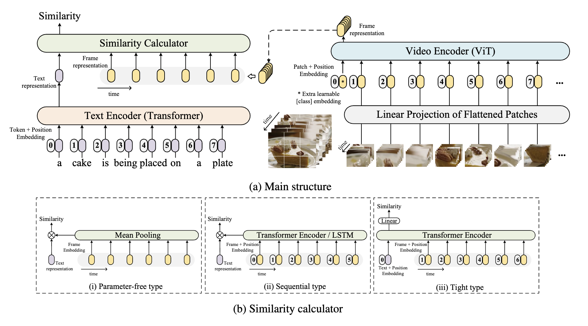
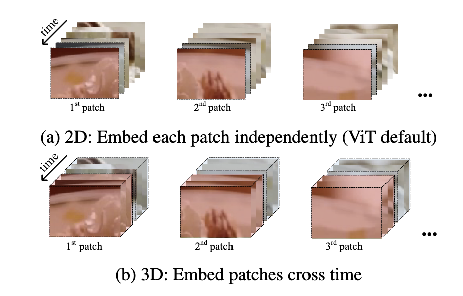
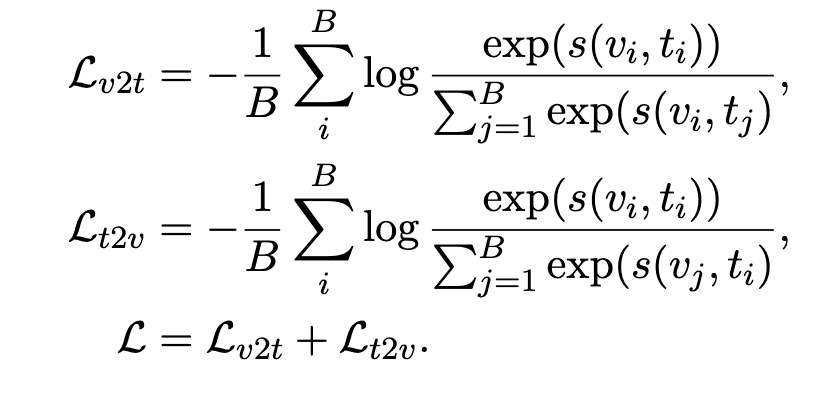

# CLIP4Clip: An Empirical Study of CLIP for End to End Video Clip Retrieval

- https://arxiv.org/pdf/2104.08860v2

## 概要
- CLIPと同じことを(video clip, text)でやる
- CLIP4Clip (CLIP For video Clip retrieval)

## CLIP4Clip
- 下図が全体図
(元論文より引用)
- 上が全体のアーキテクチャでCLIPと同じ
- 下が類似度計算方法である
  - 1個目は学習するものがなく直接類似度を計算する方法
  - 2個目はvideo featureをLSTMに入れて得られた出力とテキストから類似度を計算する方法で追加学習が必要
  - 3個目はtext, videoの特徴量を両方とも入れて得られた出力をMLPに通して類似度を得る方法で追加学習が必要
- 以下はVideo Encoderでの計算方法
  - 上は時間軸を考慮しない2D linear
  - 下は時間軸を考慮している3D linear
  - 点線で囲まれている領域で計算する
(元論文より引用)
- 以下は損失関数でclipと同じ
(元論文より引用)