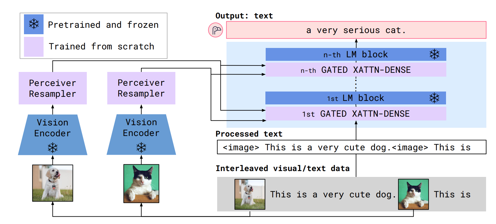
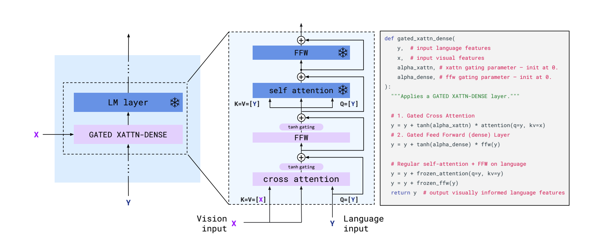

# Flamingo: a Visual Language Model for Few-Shot Learning

- https://arxiv.org/pdf/2204.14198

## 概要
- テーマはVLM(Visual Language Model)
- タスクは(vision, text) -> text
    - captioning, visual dialogue, VQAなど
    - visionはimage, videoどっちでも
- Flamingoを提案

## Related work
- Perceiverについて
    - Perceiver: General perception with iterative attention(ICML2021)
    - End-to-end object detection with transformers(ECCV2020)

## Flamingo

- 図を見ればわかる
- vision encoderは固定
- perceiver resamplerとLanguage ModelのGATED XATTN-DENSEの中のcross attentionとfeed forwardのみ学習
- perceiver resamplerは任意の長さのspatio-temporal features(動画でも画像でも)を受け取り、固定長のvisual tokensを出力
    - perceiver resamplerを使うことで長い動画や解像度の高い画像も扱える
## 英語
- handful : 一握りの
- seamlessly : 滑らかに、中断することなく
- endow : 与える