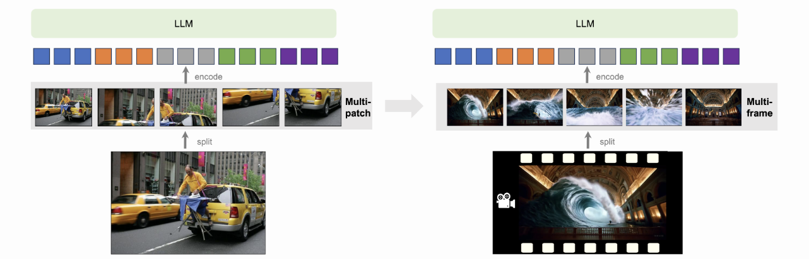
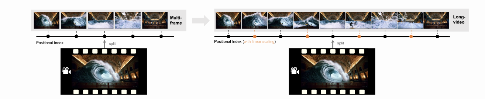

# LLaVA-NeXT(Video)
- 論文ない
- 公式ブログまとめ

## ソース
- https://llava-vl.github.io/blog/2024-04-30-llava-next-video/
- https://huggingface.co/
- https://github.com/LLaVA-VL/LLaVA-NeXTcollections/lmms-lab/llava-video-661e86f5e8dabc3ff793c944

## 概要
- Large Multimodal Model(LMM)であるLLaVA-NeXTを2024/01/230にリリース
- image-based multimodal understanding taskで高性能
- image bencmarkのいくつかでGemini-Proに勝つ
- 以下4つ重要なこと
1. Zero-shot video representation capabilities with AnyRes
    - AnyResの考え方を動画に拡張
2. Inference with length generalization improves on longer videos
    - linear scalingで動画の長さを一般化した
3. Strong video understanding ability
    - LLaVA-Next-Imageは上の1と2を用いたLMMで動画でfine-tuning
    - LLaVA-Next-VideoはLLaVA-Next-Imageに対して動画データでさらにsupervised fine-tuning
    - LLaVA-Next-Video-DPOはAI feedbackでDPOをつかってアラインメント
4. Efficient deployment and inference
    - SGLangで簡単にデプロイできるらしい

## AnyRes: From multi-patch to multi-fram
- AnyResは高解像度の画像をパッチに分割してそれらをシーケンスとして並べることでLLMの入力とするもの
- 高解像度の画像をパッチに分割という考え方と同じようにして、動画をフレームに分割してシーケンスとして並べたということ

(サイトより引用)

## Length generalization: From multi-frame to long-video
- RoPEのlinear scalingを用いて長さの一般化
- max_token_lengthを変更

(サイトより引用)

## Direct Preference Optimization from AI Feedback
- LLaVA-NeXT-Videoの生成データを用いてLMMをDPOでtrainしたものがLLaVA-NeXT-Video-DPO