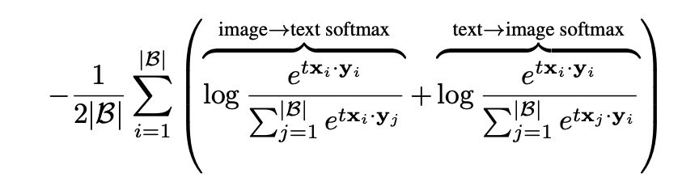
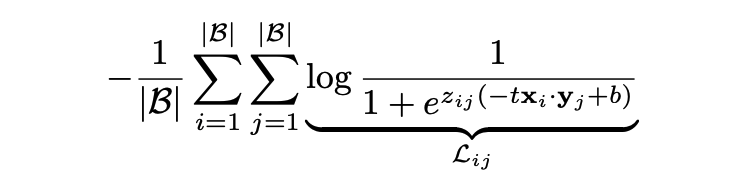
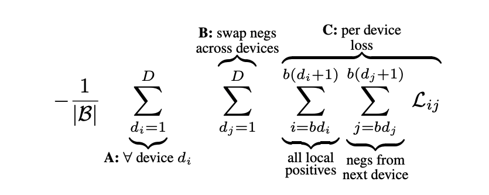
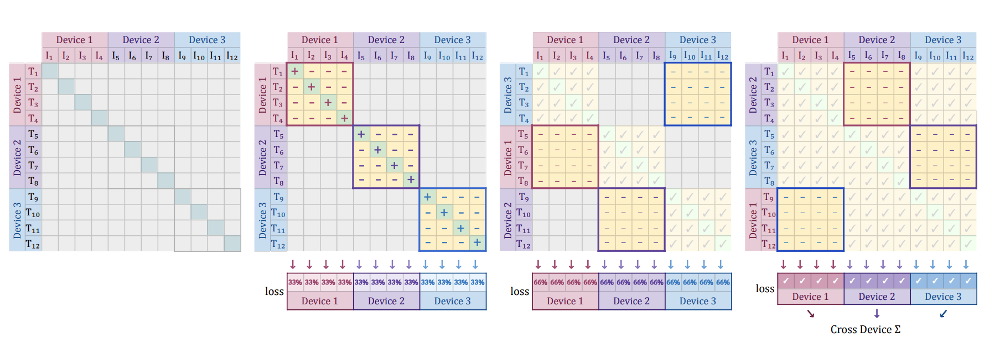

# Sigmoid Loss for Language Image Pre-Training

## 概要
- vision and languageのpre-trainingの話
- SigLIPを提案
- CLIPはsoftmax lossを使うけどSigLIPはsigmoid lossを使う

## CLIP
- 比較のためにCLIPから説明
- データセットからとってきたmini-batchを$\mathcal{B}=\{\left(I_1, T_1\right), \left(I_2, T_2\right), \cdots\}$とする
- image modelを$f(\cdot)$, text modelを$g(\cdot)$とする
- $\mathbf{x}_i = \frac{f\left(I_i\right)}{\| f\left(I_i\right) \|_2}, \mathbf{y}_i = \frac{g\left(I_i\right)}{\| g\left(I_i\right) \|_2}$とする
- このときCLIPはpairとなっている$(i,i)$の確率を大きくするためlossは以下

- $t$は学習可能なパラメータ

## SigLIP
- SigLIPでは二値分類タスクを考えて、画像とテキストが与えられたときにペアならpositive, ペアでないならnegativeとする
- このときlossは以下

- $b$は学習可能なパラメータ

## Efficient chunked implementation of siglip
- デバイスの個数を$D$として、$b=\frac{\| \mathcal{B}\|}{D}$とする
- このとき以下のようにして計算可能(未理解)

(論文より引用)

## 英語
- dissimilar : 異なる
- unstablle : 不安定な
- outdate : 時代遅れの