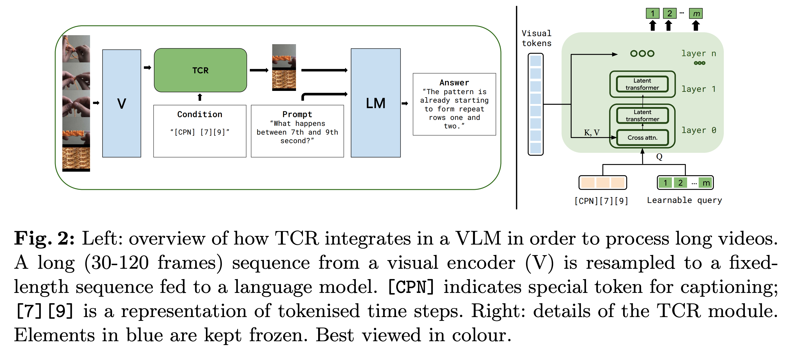

# Text-Conditioned Resampler For Long Form Video Understanding(ECCV2024)

## 概要
- TCR(Text Conditioned Resampler)を提案
- 長い動画を扱うためにLLMに入れる前に必要な部分だけ選択させる
- この必要な部分だけの選択をtextの条件付けで行う

## Related work
- Perceiver Resampler in Flamingo
- Q-former in BLIP-2

## TCR
- 図を見ればわかる

- Vがvisual encoder, LMがLLM
- visual tokensとtextをTCRに入れる
- 内部はcross attention
- video, text conditionをTCRに入れて得られた固定長のvideo tokenとpromptをLLMに入れる