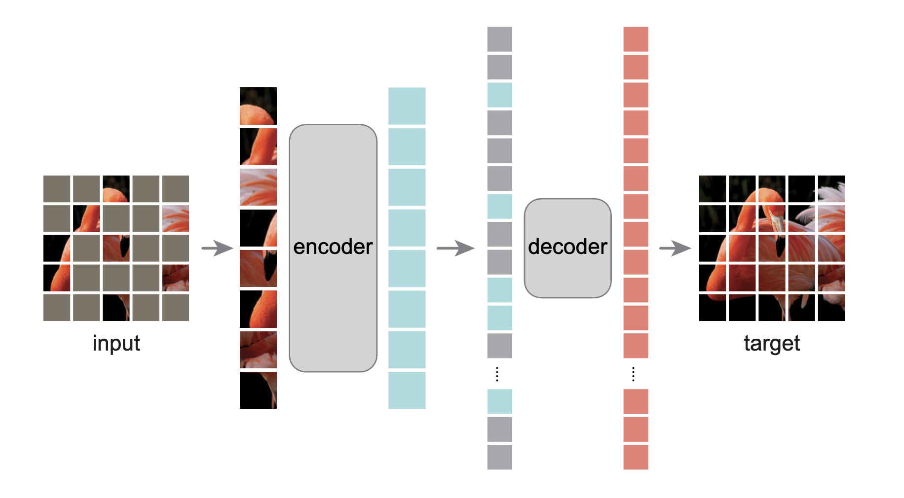

# Masked Autoencoders Are Scalable Vision Learners

- https://arxiv.org/pdf/2111.06377

## 概要
- Facebook AI Research (FAIR)
- 画像の事前学習手法としてMAEを提案
- 自己教師あり学習
- NLPのmasked language moddelingから着想を得た

## Related work
- Masked Language Modeling
  - BERT
  - GPT
- Autoencoding
  - DAE(Denoising Autoencoder)
- Masked Image Encoding
  - iGPT
  - BEiT

## MAE
- Masked Autoencoders
- 画像の事前学習タスク
- 入力画像をViTと同様にパッチに分割してpositional encoding
- 得られたリストをシャッフルして後半の数個にマスクをつける
- マスクをつけられなかったパッチのみをEncoderに入力して同じ長さの中間表現を得る
- Encoderから得られた表現にマスクされたパッチを追加してDecoderに入れる
- Decoderは元画像を予測する

(元論文より引用)

## 英語
- nontrivial : ささいではない、重要な、非自明な
- holistic : 全体的な
- induce : 誘発する
- extrapolation : 外挿