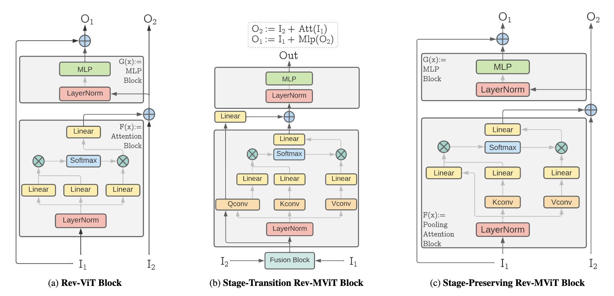

# Reversible Vision Transformers

- https://openaccess.thecvf.com/content/CVPR2022/papers/Mangalam_Reversible_Vision_Transformers_CVPR_2022_paper.pdf

## 概要
- ViTを可逆的にしたRev-ViTを提案

## Rev-ViT
- 下図のように入出力を2つに増やしてMLPとattentionの残差接続部分でreversible blockと同じような構造にする

