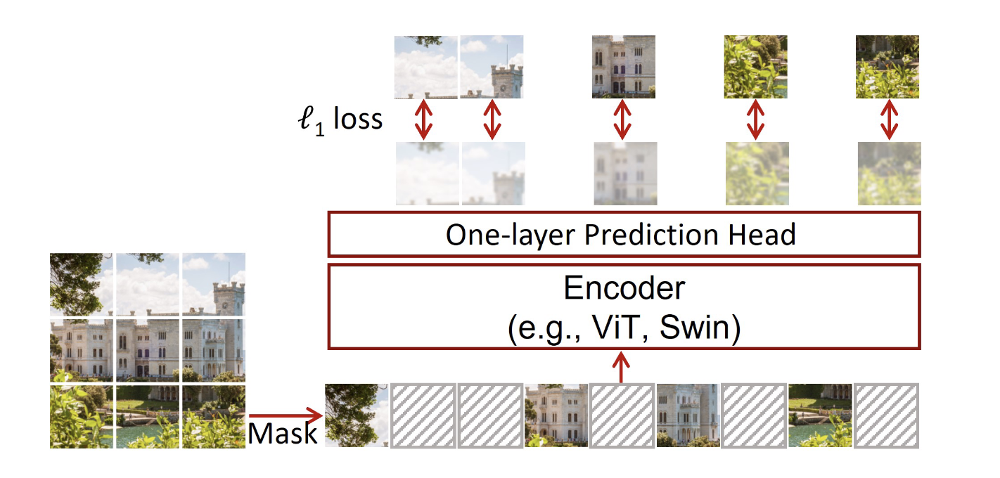

# SimMIM: a Simple Framework for Masked Image Modeling

- https://arxiv.org/pdf/2111.09886

## 概要
- 画像の事前学習手法
- タスクはMAEと同様にパッチの穴埋め

## SimMIM
- 画像を見ればわかる
- MAEと同様にして複数のパッチをmaskingして予測するタスク
- MAEと異なるのはEncoder,DecoderがasymmetricではなくEncoderにmaskも一緒に全パッチ入れる

(元論文より引用)